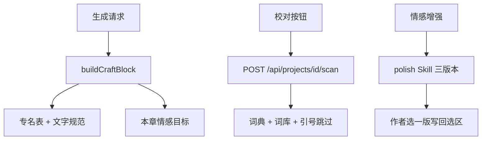

# 评校与情感

Feature Name: proofread-emotion
Updated: 2026-09-03

## Description

在现有创作契约上增加文字规范和情感指令；本地规则扫描错字与概括性情绪；作者触发模型校对和三版本情感增强。

## Architecture

## Components and Interfaces

- `backend/src/quality.js`: 抽专名、词典扫描、情感平淡段扫描。
- `backend/src/craft.js`: 注入文字规范和情感指令。
- `POST /api/projects/:id/scan`: 本地扫描，不走模型。
- 制作台：情感面板、词库、问题列表、选区校对/情感增强、大纲板情绪点。

## Data Models

- `craft.mood` / `intensity` / `emotionStyle` / `showDontTell`
- `lexicon.keep` / `lexicon.map[{from,to}]`
- `chapter.mood` / `emotionStart` / `emotionEnd`
- 扫描问题: `kind typo|emotion`, `start`, `end`, `original`, `suggest`, `reason`

## Correctness Properties

- 规则扫描不改写正文，只标记。
- 接受建议只替换对应偏移，其它文字保持原样。
- 专名表按当前书动态生成，不写死示例人名。

## Error Handling

- 扫描空章返回空列表。
- 情感增强失败时在状态栏显示模型错误，选区保留。

## Test Strategy

- `quality.js` 对含「做为」「他很伤心」的样例应分别标 typo 与 emotion。
- 引号内「做为」应被跳过。

## References

- 当前工作区 `/backend/src/craft.js`
- 当前工作区 `/frontend/src/pages/Studio.tsx`
