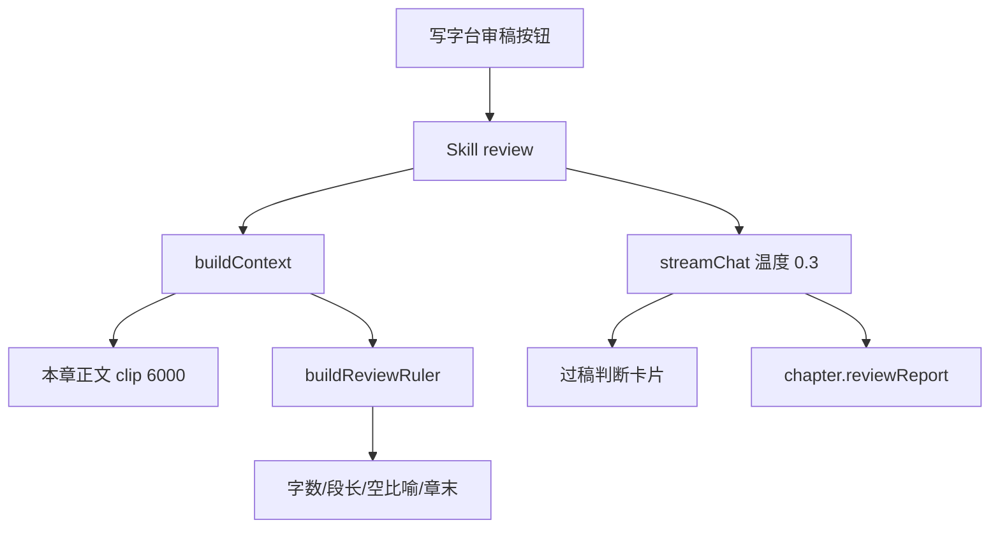

# 番茄章节审稿

Feature Name: chapter-review
Updated: 2026-09-08

## Description

把制作台现有「审稿」从设定一致性检查升级为番茄式章节审稿。本地先量字数、钩子、空比喻，再让模型按固定小节出过稿判断和改稿清单。报告落在当前章。

## Architecture

## Components and Interfaces

- `skills/builtin/09-review.md`: 番茄审稿说明书，id 仍为 `review`。
- `backend/src/review.js`: 本地标尺和过稿结论解析。
- `backend/src/context.js`: 审稿时注入本地标尺。
- `backend/src/apply.js`: 把报告写入当前章。
- `frontend/src/review.ts`: 解析小节和结论。
- `frontend/src/ReviewReport.tsx`: 卡片展示。
- `frontend/src/pages/Studio.tsx`: 按钮结论角标、流式原文、结束后卡片。

## Data Models

- `chapter.reviewReport`: 完整 Markdown 报告
- `chapter.reviewVerdict`: `过` | `改后过` | `不过` | 空
- `chapter.reviewAt`: ISO 时间

## Correctness Properties

- 审稿不改写正文。
- 本地标尺只陈述可计算事实，不打品味分。
- 模型禁止编造平台数据。
- 空章不发请求。

## Error Handling

- Skill 未加载时状态栏提示去资产页检查是否停用。
- 生成失败时保留上次报告。

## Test Strategy

- `buildReviewRuler` 对不足最低字数的章标出差额。
- `parseReviewVerdict` 对含「改后过」的报告返回「改后过」，且不被单独的「过」抢先。

## References

- 当前工作区 `/skills/builtin/09-review.md`
- 当前工作区 `/frontend/src/pages/Studio.tsx`
