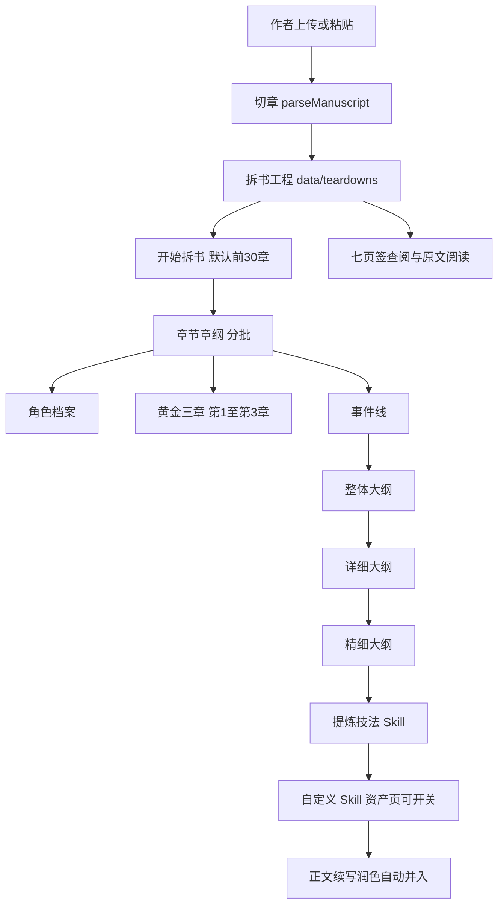

# 拆书系统

Feature Name: book-deconstruct
Updated: 2026-09-09

## Description

在墨枢左侧栏增加「拆书」工作台。作者上传或粘贴参考小说后，本地按章切开，默认只把前 30 章纳入拆解。再按七个页签调用拆书 Skill，生成章节章纲、角色档案、黄金三章、事件线、整体大纲、详细大纲、精细大纲。作者可点开导入原文核对。提炼出的写法则生成一条自定义技法 Skill，启用后自动并入章节正文、续写与润色。

书源只接受作者自备的 TXT / Markdown / EPUB / 粘贴正文。不登录番茄、起点等站点，不按平台目录抓章。

## Architecture

拆书工程与稿本工程分库存放。切分复用现有 `parseManuscript`。导入可保存全书供阅读；模型只吃 `scopeEnd` 以内的章。长篇按页签分层、分批走现有 SSE 生成通道。



前端路由：`/teardown` 列表，`/teardown/:id` 工作台。生成走 `POST /api/teardowns/:id/generate`，协议与现有 `/api/generate` 相同（SSE `meta` / `token` / `done` / `error`）。

## Components and Interfaces

### 拆书仓库 `backend/src/teardown.js`

职责：拆书工程的增删改查、切章入库、产物写入。文件落在 `data/teardowns/td_*.json`。标识校验与稿本相同，前缀 `td_`。

### 导入

- TXT / Markdown：UTF-8 解码后交给 `parseManuscript`。
- 粘贴：同一解析器，最少 500 字。
- EPUB：解压 `OEBPS`/`Text` 下的 xhtml，去标签后拼成 Markdown 再切章。无 zip 能力时提示另存为 TXT。

切不到「第N章」时，按每 3000 字切「第N节」。全书章节都保存。`scopeEnd` 默认 `min(章节数, 30)`。「开始拆书」只把 `index <= scopeEnd` 的章送给模型。作者可把 `scopeEnd` 调大后重跑新增区间。

### 拆书 Skill

内置说明书放在 `skills/builtin/`，`id` 保持稳定：

| id | 页签 | 输入 | 输出 |
|---|---|---|---|
| teardown-beats | 章节章纲 | 每批 8 章，每章文首 400 字 + 文末 400 字 | `### 第N章 标题` + 目标/冲突/出场/钩子 各一句 |
| teardown-cast | 角色档案 | 章纲全文 + 前 3 章摘录 | `### 姓名` + 身份/欲望/关系/声口/首次出场章 |
| teardown-golden | 黄金三章 | 第1至第3章正文，每章最多 6000 字 | 人设、冲突、金手指兑现、三章钩子 |
| teardown-events | 事件线 | 章纲全文 | 节点：发生章、谁做什么、代价或转折 |
| teardown-outline | 整体大纲 | 章纲 + 事件线 | 按卷或大阶段一页 |
| teardown-detail | 详细大纲 | 整体大纲 + 章纲 | 冲突与高潮 |
| teardown-fine | 精细大纲 | 详细大纲 + 章纲 | 场面节拍 |
| teardown-craft | 技法 Skill | 黄金三章 + 抽样章纲 + 角色声口 | 自定义 Skill 说明书，禁止大段原文 |

「开始拆书」按表中顺序连跑到精细大纲。单页签可重跑。作者可停止当前流。技法 Skill 由「提炼技法」单独触发。

### 生成上下文

新建 `buildTeardownContext`，与 `buildContext` 并列。只注入当前页签需要的摘录，单次用户消息控制在约 1.2 万字以内。章纲生成按 8 章一批，循环直到 `scopeEnd`，页签数量累加。

### 工作台 UI

视觉跟墨枢夜案。信息架构跟截图：顶部七页签，文案右侧显示条目数。

- 左：导入摘要、拆解范围、开始拆书、提炼技法、章节目录。点目录某一章，主区阅读该章导入原文。
- 中：当前页签列表与详情。卡片点开可看摘要。
- 产物展示以条目为主，原句摘录不超过 80 字并标明章号。

左侧栏在「稿本」和「资产」之间加「拆书」。

### 技法 Skill

`teardown-craft` 按 `### [skillId]` 分步输出。全文写入 `tdcraft_<拆书工程id>`（资产页总闸）；各步写入 `tdcraft_<id>__<skillId>` 补丁，只注入对应开书步骤。生成时把补丁叠进该步 Skill 说明书。再次提炼时带着已有补丁升级，写得更具体。七栏拆齐后自动提炼一次。

## Data Models

```text
Teardown
  id: td_*
  title: string
  sourceName: string
  importedAt: iso
  updatedAt: iso
  status: active | archived
  scopeEnd: number
  skillId: string
  chapters: TeardownChapter[]
  beats: string
  cast: string
  golden: string
  events: string
  outline: string
  outlineDetail: string
  outlineFine: string
  logs: LogItem[]

TeardownChapter
  id: string
  index: number
  title: string
  content: string
  wordCount: number
  beat: string

Skill.inject: string
```

页签数量规则：

- 章节章纲：已写入 `beat` 的章节数；尚未拆时为拆解范围内的章节数
- 角色档案：`###` 人物标题数
- 黄金三章：报告小节数
- 事件线 / 三层大纲：各自 `###` 或节点数

## Correctness Properties

- 拆书工程文件写不到 `data/novels/`，稿本写不到 `data/teardowns/`。
- 切章与导入解析器对同一份 Markdown 得到相同的章节数与标题。
- 黄金三章 Skill 只读取 `index <= 3` 的章节。
- `scopeEnd` 默认不超过 30；生成上下文只包含 `index <= scopeEnd` 的章。
- 技法提炼只创建或覆盖 `tdcraft_<id>` 这条自定义 Skill，不改稿本章节 `content`。
- 生成请求在拆书工程缺少正文时直接返回错误，不调用模型。

## Error Handling

| 场景 | 处理 |
|---|---|
| 文件无法解码或不足 500 字 | HTTP 400，提示换一份完整正文 |
| EPUB 解压失败 | HTTP 400，提示另存为 TXT 再传 |
| 模型流中断 | 已生成文本写入对应字段，状态 `stopped`，页签保留部分结果 |
| 技法 Skill 写入失败 | HTTP 500，拆书产物保留，提示稍后重试提炼 |
| 作者请求平台抓章 | 接口不提供该能力；工作台导入区写明只接受上传和粘贴 |

## Test Strategy

- `parseManuscript`：带「第N章」的样例切出对应章；无标题样例按 3000 字切节。
- 拆书仓库：创建、导入、分批写入章纲后页签计数正确。
- 范围：40 章导入样例下，默认只把前 30 章送进拆书生成。
- 上下文：单次 `teardown-beats` 消息不超过 8 章摘录。
- 技法 Skill：启用后 `chapter-prose` 上下文含「对标技法」；停用后消失。
- 前端：七页签顺序与文案固定；点章节可阅读导入原文。

## References

[^1]: (Filename) - 现有切章解析 当前工作区 `/backend/src/importers.js`
[^2]: (Filename) - 稿本生成 SSE 当前工作区 `/backend/src/index.js`
[^3]: (Filename) - Skill 加载 当前工作区 `/backend/src/skills.js`
[^4]: (Filename) - 需求 当前工作区 `/.monkeycode/specs/2026-09-09-book-deconstruct/requirements.md`
