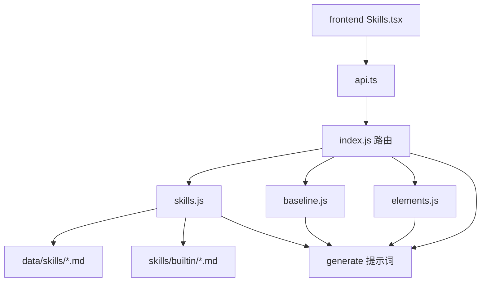

# Skill 体系全面升级 · 技术设计

Feature Name: skill-upgrade
Updated: 2026-09-12

## 描述

在现有 Skill 体系上做四层升级，保持既有 Skill id、`data/` 数据结构与生成契约不变：

1. 运行时：条件注入 + 共享质量基线单一来源。
2. 功能：标签/检索、单份 Markdown 导入导出、历史行级 diff。
3. 内容：内置写作 Skill 结构统一，重复约束抽到共享基线。
4. 深度：正文 Skill 与仿写骨架 Skill 精细化。

## 架构



共享质量基线以代码常量形式存在于 `backend/src/baseline.js`，在生成写稿提示词时统一注入；内置 Skill 正文不再重复定义同一约束。

## 组件与接口

### baseline.js（新增）

- `BASELINE_VERSION`：基线版本号。
- `buildBaselineBlock({ voiceActive, skill })`：返回字符串数组。
  - voiceActive 为真时只保留最低阅读格式（全角标点、系统【】、章首承接、去AI 自检口径）。
  - voiceActive 为假时补齐平台通用家规（段落节奏、去AI 量化口径、硬禁词指向 `genre.js` 单一来源）。
- 基线只描述「底线」，不覆盖类型引擎、平台特供、金手指规则（仍由 `genre.js`/`craft.js` 提供）。

### skills.js（扩展）

- `toSkill`：解析 `tags`、`whenFlow`、`whenPlatform`、`whenVoice`。
- `serializeSkill`：写回上述字段；`tags` 用逗号分隔。
- `createSkill`/`updateSkill`/`cloneSkill`/`exportSkills`/`importSkills`/`updateBuiltinMeta`：透传新字段。
- `listInjectedGuides(skillId, ctx)`：`ctx = { flow, platform, voiceActive }`；按 `when*` 过滤。
- `skillPromptBody(skill, opts)`：`opts` 增加 `flow`、`platform`，透传给 `listInjectedGuides`。
- `exportSkillMarkdown(skill)`：返回带 front matter 的 Markdown。
- `importSkillMarkdown(text, filename)`：解析并落库为自定义 Skill，id 冲突时用 `uid("sk")`。
- `toPublicSkill`：增加 `tags`、`whenFlow`、`whenPlatform`、`whenVoice`。

### index.js（扩展）

- 生成路由把 `novel.craft` 的 flow/platform 传入 `skillPromptBody`，并在最前拼 `buildBaselineBlock`。
- 新增 `GET /api/skills/:id/markdown`：返回 `text/markdown` 附件。
- 新增 `POST /api/skills/import-markdown`：body `{ text, filename }`。

### 前端

- `types.ts`：Skill 增加 `tags`、`whenFlow`、`whenPlatform`、`whenVoice`。
- `api.ts`：`exportSkillMarkdown`、`importSkillMarkdown`。
- `Skills.tsx`：
  - 搜索命中名称/场景/标签/正文。
  - 标签筛选条 + 列表显示标签。
  - 自定义 Skill 编辑器增加注入条件（flow/platform/voice/注入目标）。
  - 顶部「导入」支持 `.md` 与 `.json`。
  - 历史弹窗增加行级 diff（新增/删除行）。
- 历史 diff 用轻量 LCS 行比较，前端本地计算。

## 数据模型

Skill front matter 扩展字段（全部可选）：

```yaml
tags: 节奏,人味
whenFlow: horror,system
whenPlatform: fanqie
whenVoice: active
```

- `tags`：字符串数组，序列化为逗号分隔。
- `whenFlow`：流 id 白名单，空表示不限。
- `whenPlatform`：平台 id 白名单，空表示不限。
- `whenVoice`：`active` 表示仅文风激活时注入；空表示不限。

## 正确性属性

1. 旧文件缺省新字段时，`listSkills`/`listInjectedGuides` 行为与升级前一致。
2. `when*` 条件为 AND 关系；任一不满足则跳过注入。
3. 共享基线是写作类提示词的唯一底线来源，同一约束不在内置 Skill 正文重复。
4. Markdown 导入导出可往返：导出再导入不丢 id/name/body/tags/条件。
5. Skill id 不变；内置 Skill 只能改元数据与覆盖正文，不能改 id。

## 错误处理

- `importSkillMarkdown`：无 front matter 时用文件名补名称；缺 target/order 用默认值；解析失败返回 400。
- 注入条件字段非法值一律忽略，按不限处理，不抛错。
- 历史 diff 输入为空时显示「无可比较内容」。

## 测试策略

- 后端：`node --check` 语法检查；用样例稿本调用 `buildGenreBlock`、`skillPromptBody`、`listInjectedGuides` 断言条件过滤；Markdown 往返断言。
- 前端：`npx tsc --noEmit` + `npx vite build`。
- 接口冒烟：`/api/skills`、`/api/skills/:id/markdown`、`/api/skills/import-markdown`。

## 参考

[^1]: (File) - `backend/src/skills.js`
[^2]: (File) - `backend/src/index.js`
[^3]: (File) - `frontend/src/pages/Skills.tsx`
