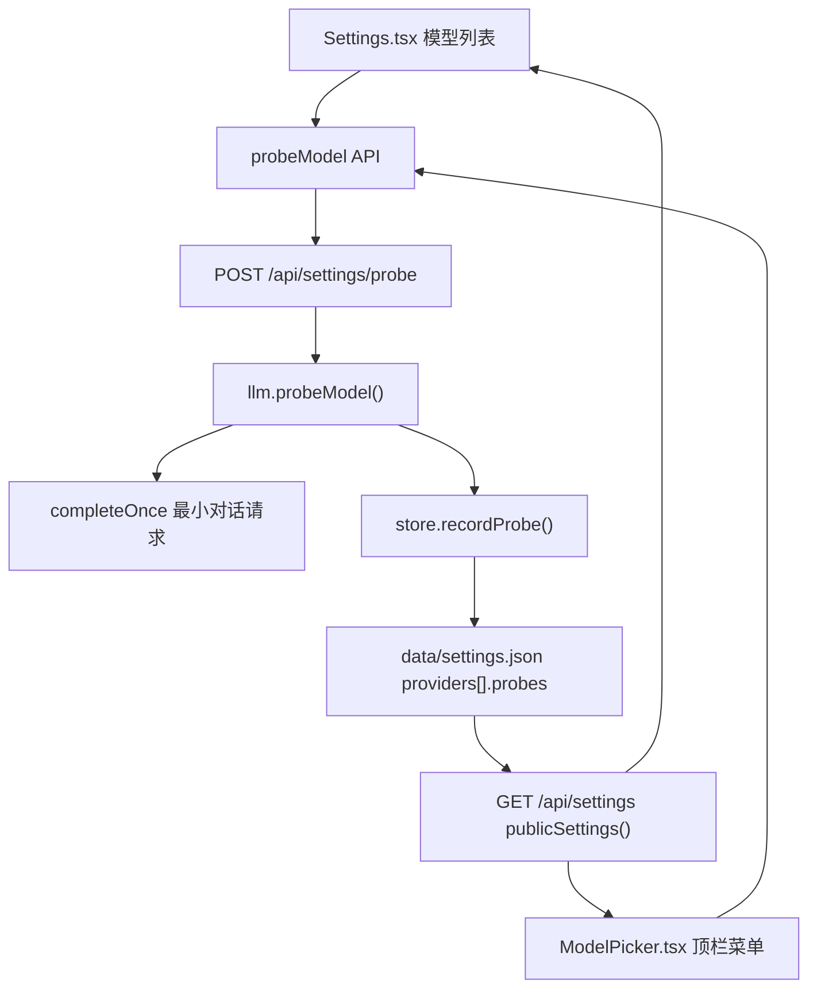

# 墨枢 · 模型可用性点亮与探测延时

Feature Name: model-health
Updated: 2026-09-18

## Description

为每个候选模型提供可用性探测与状态展示。作者可在设置页或顶栏模型菜单里逐个探测、或一键探测整组模型；探测结果（可用/不可用、延时毫秒、原因、探测时间）写入本地配置并随设置接口返回。界面用绿/红/灰三态点亮模型行并显示延时，让作者一眼分辨能用的模型。探测复用既有的最小对话请求实现，不写写作日志，错误信息不含 Token。

## Architecture



探测只读供应商配置（地址、协议、Token），按 `model` 逐个请求上游；结果回写同一份 `settings.json` 的 `providers[].probes`。设置接口在返回供应商时附带 `probes` 与 `probeTtlMs`，前端据此计算三态与过期。

## Components and Interfaces

### 后端

- `backend/src/providers.js`
  - `PROBE_TTL_MS = 12 * 60 * 60 * 1000`，`probeTtlMs()` 支持 `MODEL_PROBE_TTL_MS` 覆盖（clamp 1 分钟–7 天）。
  - `cleanProbes(map, models)`：只保留 `map` 中 key 属于 `models` 的条目，字段规整为 `{ ok, ms, reason, at }`。
  - `normalizeProvider(row, fallbackKey, prev)`：新增 `probes`，来源 `row.probes` 优先、回退 `prev.probes`，再经 `cleanProbes` 按最终 `models` 裁剪。客户端保存设置时不回传 `probes`，因此服务端记录不会被覆盖。
  - `hydrateSettings` 经由 `normalizeProvider` 自动带上磁盘上的 `probes`。
  - 导出 `cleanProbes`、`probeTtlMs`。
- `backend/src/store.js`
  - `publicSettings()`：每个 provider 增加 `probes`，每条形如 `{ ok, ms, at, reason, stale }`，`stale = Date.now() - at > probeTtlMs()`；顶层增加 `probeTtlMs`。
  - 新增 `recordProbe(providerId, model, result)`：读设置 → 定位 provider → 写 `probes[model] = { ok, ms, reason, at }` → 按该 provider 的 `models` 裁剪 → 原子写回 → 返回规整后的条目（含 `stale:false`）。
  - 导出 `recordProbe`。
- `backend/src/llm.js`
  - 新增 `probeModel(draft)`：`resolveSettings(draft)` 后校验 `baseUrl`、`model`、必需 Token（缺失则抛 400，不发网络请求）；用 `probeMs()` 超时，`completeOnce` 发 `messages:[{role:"user",content:"只回复：ok"}]`、`temperature:0`、`maxTokens:8`、`thinking:false`；用 `Date.now()` 量取耗时；成功返回 `{ ok:true, ms, at, reply }`，失败返回 `{ ok:false, ms, at, reason, status, code }`（`reason` 走既有 `publicLlmError`/`endpointLabel`，不含 Token）。
  - `testChat(draft)` 改为调用 `probeModel`，成功返回 `reply || "已接通"`，失败把 `reason/status/code` 抛成错误；两入口共用同一实现。
  - 导出 `probeModel`。
- `backend/src/index.js`
  - `POST /api/settings/probe`：body `{ providerId?, baseUrl?, apiKey?, protocol?, model }`。先校验 `model` 非空（否则 400）；调用 `probeModel`；命中 `providerId` 时 `recordProbe`；响应 `{ ok, ms, reason?, at, model, providerId }`。失败也返回 200（携带 `ok:false`），便于批量逐个展示；配置缺失仍返回 400。

### 前端

- `frontend/src/types.ts`：新增 `ModelProbe = { ok:boolean; ms:number; at:string; reason?:string; stale?:boolean }`；`ProviderPublic.probes?: Record<string, ModelProbe>`；`Settings.probeTtlMs?: number`。
- `frontend/src/api.ts`：`probeModel(body)` → `POST /api/settings/probe`，返回 `{ ok, ms, reason?, at, model, providerId }`。
- `frontend/src/model-groups.ts`：`ModelEntry` 增加 `probe?: ModelProbe`；`groupModels` 从 `provider.probes?.[model]` 填入。
- `frontend/src/use-probe.ts`（新增）：`useProbe()` 暴露 `busyKey`、`progress`、`probeOne(item)`、`probeMany(items)`、`stop()`；并发上限 2，逐个把结果交回调 `onResult(providerId, model, probe)`；支持中止未开始项。
- `frontend/src/pages/Settings.tsx`：模型列表每行改为「状态点 + 模型名 + 延时 + 探测按钮」；`拉取列表` 旁增加 `全部探测`；批量时显示 `已完成 x/y` 与 `停止`；结果就地合并进 `providers[].probes`（不重拉设置）。
- `frontend/src/ModelPicker.tsx`：分组模型行显示同一状态点与延时；`pick-head` 增加 `全部探测`（对当前分组）、进度与停止；结果合并进本地 `settings`。
- `frontend/src/styles.css`：新增 `.probe` 系列样式（绿/红/灰空心/琥珀过期 + 延时文本），点缀不改变既有行高。

## Data Models

`data/settings.json` 中每个 provider 新增：

```json
{
  "probes": {
    "deepseek-chat": { "ok": true, "ms": 312, "reason": "", "at": "2026-09-18T02:31:07.412Z" },
    "deepseek-reasoner": { "ok": false, "ms": 5041, "reason": "接口 5 秒内没有响应（api.deepseek.com/v1）", "at": "2026-09-18T02:32:10.008Z" }
  }
}
```

服务端返回时补 `stale`。`ms` 为整数毫秒；`at` 为 ISO 时间；`reason` 仅在 `ok:false` 时非空。

## Correctness Properties

1. `probes` 的键集合始终是 provider `models` 的子集；模型被移除后其探测记录同批消失。
2. 客户端 `PUT /api/settings` 永不覆盖服务端 `probes`（payload 不含该字段，`normalizeProvider` 回退 `prev.probes`）。
3. 任何探测错误信息都不含 API Token，只含主机名与路径。
4. 探测不写入写作日志、不改变章节内容与字数。
5. 单次探测耗时上限为 `probeMs()`；到点即中止并记为失败。
6. 三态互斥：`ok:true` → 绿；`ok:false` 且未过期 → 红；无记录或 `stale` → 灰。

## Error Handling

- 未填地址 / 未填模型 / 非 Ollama 缺 Token：400，携带具体缺失项，不发网络请求。
- 上游 401/403：`ok:false`，`reason` 为既有脱敏文案，红点。
- 上游 404/模型不存在：`ok:false`，`reason` 指明模型不可用。
- 安全拦截：`ok:false`，`reason` 提示被拦截，红点，不重试。
- 超时：`ok:false`，`reason` 含「N 秒内没有响应（host/path）」。
- 网络不通：`ok:false`，`reason` 含主机名。
- 批量中单个失败不中断其余项；批量被作者停止时，未开始项保持原状态。

## Test Strategy

- 后端单测（node 脚本，复用 `scripts/llm-mock-test.js` 的 mock 服务）：探测成功延时为正整数；超时记失败；401/400/安全拦截/网络错误各自归类；`probes` 裁剪；客户端保存不覆盖 `probes`；错误文案不含 Token。
- `scripts/llm-mock-test.js` 增补 `probe-*` 场景，保持全绿。
- 前端：`npx tsc --noEmit` + `npx vite build`。
- 实机冒烟：本地 8787 真实探测 `deepseek-flash`，确认返回 `ok:true` 与毫秒数，且 `data/settings.json` 中 `probes` 落库、刷新页面后点亮保留。

## References

[^1]: (backend/src/llm.js#L889) - 既有 `testChat` 探测实现，本需求改为共用 `probeModel`
[^2]: (backend/src/store.js#L314) - `publicSettings`，新增 probes 与 probeTtlMs 输出
[^3]: (backend/src/store.js#L353) - `saveSettings`，探测缓存需不被客户端保存覆盖
[^4]: (backend/src/providers.js#L105) - `normalizeProvider`，新增 probes 规整与裁剪
[^5]: (frontend/src/pages/Settings.tsx#L404) - 设置页模型列表，接入状态点与探测按钮
[^6]: (frontend/src/ModelPicker.tsx#L214) - 顶栏模型菜单列表，接入同一状态展示
