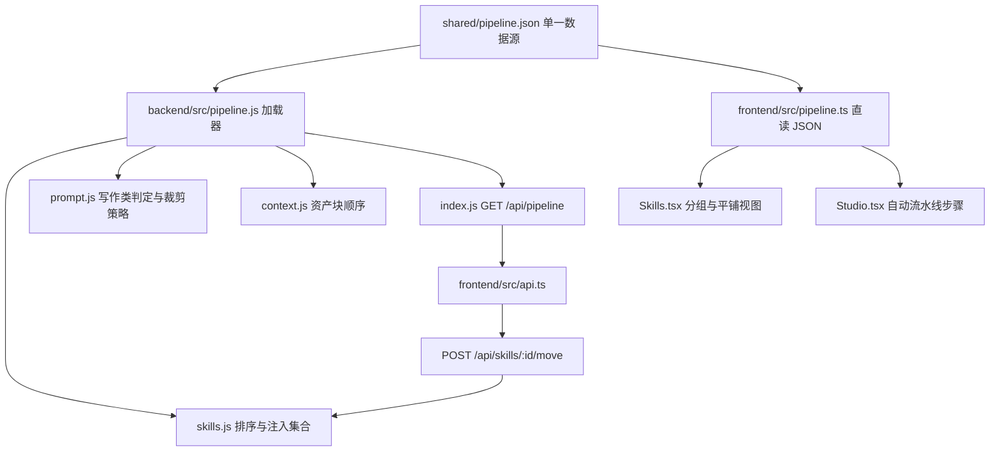

# Skill 流水线统一重设计 · 技术设计

Feature Name: skill-pipeline
Updated: 2026-09-18

## 描述

引入单一数据源的流水线定义 `shared/pipeline.json`，同时供后端与前端消费，替换当前五处需要手工保持一致的硬编码：

- 前端 `Skills.tsx` 的 `TARGETS`、`PIPE_IDS`、`sortedSkills`、`groupSkills`。
- 前端 `Studio.tsx` 的 `STEPS`、`PIPELINE`、`PIPE_SKILL_IDS`、`pipeSkillId`、`pipeSkillSlot`。
- 后端 `skills.js` 的 `TARGETS`、`WRITING_INJECT`、`CRAFT_SLOTS`。
- 后端 `prompt.js` 的 `DROP_ORDER`、`isWritingSkill`。
- 后端 `context.js` 的资产块顺序与 `SETTING_TARGETS`。

流水线定义覆盖写作线与拆书线，采用「阶段（stage）→ 阶段内 Skill 排序」两级模型：阶段顺序由定义固定，阶段内顺序由 Skill 的排序键（沿用 `order` 字段作为 `subOrder`）决定。`order` 的作用边界被限定为**列表展示顺序 + 技法注入顺序**，不改变 `context.js` 的叙事块语义。

重设计保持既有 Skill id、`data/` 数据结构与生成契约不变。

## 架构



选型理由：`shared/pipeline.json` 放在仓库根目录，后端通过 `store.js` 的 `ROOT`（`path.resolve(__dirname, "../..")`）读取，前端通过 Vite 直接 `import "../../shared/pipeline.json"`（dev 的 `server.fs.allow` 默认允许工作区根目录）。这样前端在构建期拿到静态数据，无需首屏异步等待；`GET /api/pipeline` 仅用于测试断言与运行时可观测，不作为前端主数据通道。

## 组件与接口

### shared/pipeline.json（新增，唯一数据源）

导出 `{ version, lines[] }`，`lines[]` 为流水线，`stages[]` 为阶段。字段见「数据模型」。

### backend/src/pipeline.js（新增）

- `PIPELINE`：解析后的定义（启动时读取并缓存）。
- `stageOf(skill)`：按 `target` 找阶段；`target === "guide"` 时按第一条 `inject` 目标找；找不到归入虚拟阶段 `other`。
- `stageIndex(stage)`：阶段在全局中的序号。
- `writingTargets()`：`writing === true` 的 target 集合，替代 `isWritingSkill` 的硬编码。
- `injectTargetIds()`：所有 `inject` 字段非空的阶段对应的注入键集合，替代 `WRITING_INJECT`。
- `craftSlots()`：`craftSlot === true` 的阶段，替代 `CRAFT_SLOTS`。
- `dropOrder(writing)`：直接返回定义里的 `trim.writing` / `trim.setting` 序列，替代 `DROP_ORDER`。
- `normalizeSkills(list)`：产出稳定顺序（算法见下）。

### backend/src/skills.js（改造）

- `listSkills()`：排序改为 `pipeline.normalizeSkills`。
- `toSkill`：新增 `stage`（由 `pipeline.stageOf` 推导，不落 frontmatter）。
- `toPublicSkill`：返回 `stage`。
- 删除 `TARGETS`、`WRITING_INJECT`、`CRAFT_SLOTS` 常量，改为从 `pipeline.js` 取用。
- `listInjectedGuides()`：按 `normalizeSkills` 顺序遍历，使注入顺序与阶段顺序一致。

### backend/src/prompt.js（改造）

- 删除 `DROP_ORDER` 常量，改调 `pipeline.dropOrder(writing)`（返回定义里的 `trim` 序列）。
- `isWritingSkill(skill)` 改为 `pipeline.writingTargets().has(skill.target) || pipeline.writingTargets().has(skill.id)`，保持对 `chapter-prose`/`continue`/`polish`/`target=content` 的等价判定。

### backend/src/context.js（改造）

- 设置类资产块（`brief`/`world`/`characters`/`outline`/`props`）按阶段顺序压入，替换当前固定的 `193-197` 行顺序。
- 写作类 `brief`/`characters` 两块同理按阶段顺序。
- `SETTING_TARGETS` 改为从 `pipeline` 推导（哪些 target 有输出纪律模板）。
- 其余叙事特判块保持现状，不改模型行为。

### backend/src/index.js（新增接口）

- `GET /api/pipeline`：返回 `shared/pipeline.json` 内容与 `version`。
- `POST /api/skills/:id/move`：body 支持 `{ direction: "up" | "down" }` 或 `{ beforeId, afterId }`，服务端在完整归一化顺序（非前端过滤后的列表）里定位同阶段相邻项，用中点法插值并原子落库；成功返回最新 `GET /api/skills` 结果。

### frontend/src/pipeline.ts（新增）

- `PIPELINE`：直接 `import "../../shared/pipeline.json"`。
- `WRITING_STAGES`、`STEPS`、`PIPE_SKILL_IDS`、`pipeSkillId(slot)`、`pipeSkillSlot(skillId)`、`TARGETS`、`PIPE_IDS`、`stageOf(skill)`、`groupSkills(list)`、`sortedSkills(list)`，全部由定义派生。

### 前端页面改造

- `Skills.tsx`：删除本地 `TARGETS`/`PIPE_IDS`/`sortedSkills`/`groupSkills`；`moveSkill` 改为调用 `api.moveSkill(id, dir)` 单次请求。
- `Studio.tsx`：删除本地 `STEPS`/`PIPELINE`/`PIPE_SKILL_IDS`/`pipeSkillId`/`pipeSkillSlot`；`expectJobChars`/`expectJobMs` 以阶段的 `size`/`expectMs` 为基，写作类仍按 `wordsMax` 计算。
- `api.ts`：新增 `getPipeline()`、`moveSkill(id, direction)`。
- `types.ts`：`Skill` 增加 `stage?: string`；新增 `Pipeline`/`PipelineStage` 类型。

## 数据模型

### 流水线定义

```json
{
  "version": 1,
  "trim": {
    "writing": ["brief", "characters"],
    "setting": ["props", "world", "characters", "brief", "outline", "prev"]
  },
  "lines": [
    {
      "id": "writing",
      "label": "写作线",
      "stages": [
        {
          "id": "brief",
          "label": "立项",
          "target": "brief",
          "builtin": "kickoff",
          "inject": "kickoff",
          "artifact": "brief",
          "writing": false,
          "craftSlot": true,
          "auto": true,
          "size": 700,
          "expectMs": 28000,
          "ui": { "tab": "brief", "desk": "lore", "action": "写立项", "hint": "先钉卖点、冲突和禁区" }
        }
      ]
    },
    { "id": "teardown", "label": "拆书线", "stages": [] }
  ]
}
```

- `id`：阶段 id，与 `target` 多数相同；`beats`/`content` 等与 target 一致的沿用。
- `target`：属于该阶段的 `Skill.target`。
- `builtin`：该阶段内置执行者 id，可缺省（如 `continue` 无独立界面对应槽位）。
- `inject`：技法 Skill 的 `inject` 目标键；缺省表示不接受注入。
- `artifact`：产物写入的 novel/chapter 字段，可缺省。
- `writing`：是否为写作类阶段，决定 `LEAD_WRITING` 与写作类裁剪策略。
- `craftSlot`：是否出现在拆书技法槽位。
- `auto`：是否属于自动开书流水线。
- `size`/`expectMs`：预期产出字数与耗时基数。
- `ui`：Studio 的 tab、desk、动作名与提示语。

### Skill 排序键

- `stageIndex`：来自 `stageOf(skill)`。
- `sourceRank`：`builtin`=0、`custom`=1，落实「内置先于自定义」。
- `subOrder`：沿用 frontmatter `order`，缺省内置取阶段默认、自定义取 100。
- `id`：末位稳定平手键，避免依赖 `localeCompare` 与语言环境。

比较函数按 `[stageIndex, sourceRank, subOrder, id]` 字典序升序。

### 插值重排算法

```
placeBetween(prev, next):
  if prev 为空且 next 为空: return 100
  if prev 为空: return next.subOrder - 100
  if next 为空: return prev.subOrder + 100
  if next.subOrder - prev.subOrder < EPS(1e-4): compact(stage)
  return (prev.subOrder + next.subOrder) / 2

compact(stage):
  按当前归一化顺序收集该阶段 Skill
  依次赋 100, 200, 300, ...
  仅写回数值变化者
```

删除 `Skills.tsx` 现有的 `oa === ob ? oa + dir : ob` 碰撞分支。

## 正确性属性

1. `normalizeSkills` 幂等：对同一输入重复调用结果一致。
2. `compact` 保持相对顺序不变，且产生不小于 100 的间隔。
3. 阶段顺序与语言环境无关；平手仅由 `id` 决定。
4. `injectTargetIds()` 与迁移前 `WRITING_INJECT` 的集合完全相等。
5. `craftSlots()` 与迁移前 `CRAFT_SLOTS` 的槽位集合完全相等。
6. `writingTargets()` 对既有全部内置 Skill 的判定与迁移前 `isWritingSkill` 完全一致。
7. 缺少 `stage` 的旧 Skill 仍能归入正确阶段。
8. 自动开书流水线的步骤集合仍等于迁移前 `PIPELINE` 的 7 步，自定义 Skill 不进入该集合。
9. `dropOrder("writing")` 与 `dropOrder("setting")` 返回的序列分别与迁移前 `DROP_ORDER.writing`、`DROP_ORDER.setting` 逐项相等。
10. `GET /api/pipeline` 返回的定义与前端构建期导入的定义同源同版本。

## 错误处理

- `POST /api/skills/:id/move`：id 不存在返回 404；同时传 `direction` 与 `beforeId` 返回 400；目标越界返回 409 并附原因。
- `compact` 写盘失败时，按写入前的内存快照回滚已改写的 Skill 文件，返回 500，避免半完成状态。
- 流水线定义字段缺失或类型非法时，加载器在启动阶段抛错并打印缺失字段名，不静默降级。
- `GET /api/pipeline` 失败时前端使用构建期导入的静态定义，不影响页面。

## 测试策略

- 新增 `scripts/pipeline-test.js`：对 `normalizeSkills`/`placeBetween`/`compact`/`stageOf` 做纯函数断言，含「两 Skill 间插入」「等值排序键」「间隔耗尽触发 compact」。
- 扩展 `scripts/llm-mock-test.js`：断言 `injectTargetIds`/`craftSlots`/`writingTargets`/自动步骤集合与迁移前常量集合相等（不依赖 `aigc.js`）。
- 接口冒烟：`GET /api/pipeline`、`POST /api/skills/:id/move`（上移/下移/越界）、`GET /api/skills` 顺序稳定。
- 前端：`npx tsc --noEmit`、`npx vite build`。
- 回归：任意改动后跑 `node scripts/llm-mock-test.js` 与 `node scripts/pipeline-test.js`。

## 迁移步骤

1. 新增 `shared/pipeline.json`，按现网 `TARGETS`/`WRITING_INJECT`/`CRAFT_SLOTS`/`DROP_ORDER`/`PIPELINE`/`STEPS` 的并集填齐阶段，保证正确性属性 4-8。
2. 新增 `backend/src/pipeline.js` 与 `frontend/src/pipeline.ts`，先只读不切换。
3. 切换后端 `skills.js`/`prompt.js`/`context.js`，跑回归。
4. 切换前端 `Skills.tsx`/`Studio.tsx`，跑构建与冒烟。
5. 统一内置文件名：去掉 `NN-` 数字前缀，改回以 `id` 命名（`readDirSkills` 已支持剥离前缀，去掉后仍能解析），消除「文件名序号 vs 阶段顺序」的第二数据源。
6. 更新 `CHANGELOG.md` 与 `.monkeycode/MEMORY.md`。

## 风险与取舍

- `context.js` 的叙事特判块不纳入数据驱动，只把资产块顺序改为按阶段排序，以降低改变模型行为的风险。
- 自定义 Skill 不进入自动执行，避免流水线在缺资产时被非内置 Skill 抢占。
- 阶段内「内置先于自定义」按 `sourceRank` 硬性约束，自定义 Skill 无法插到内置之前，换取排序可预测。

## 参考

[^1]: (File) - `backend/src/skills.js`
[^2]: (File) - `backend/src/prompt.js`
[^3]: (File) - `backend/src/context.js`
[^4]: (File) - `backend/src/index.js`
[^5]: (File) - `frontend/src/pages/Skills.tsx`
[^6]: (File) - `frontend/src/pages/Studio.tsx`
[^7]: (File) - `frontend/src/api.ts`
[^8]: (File) - `backend/src/store.js`
