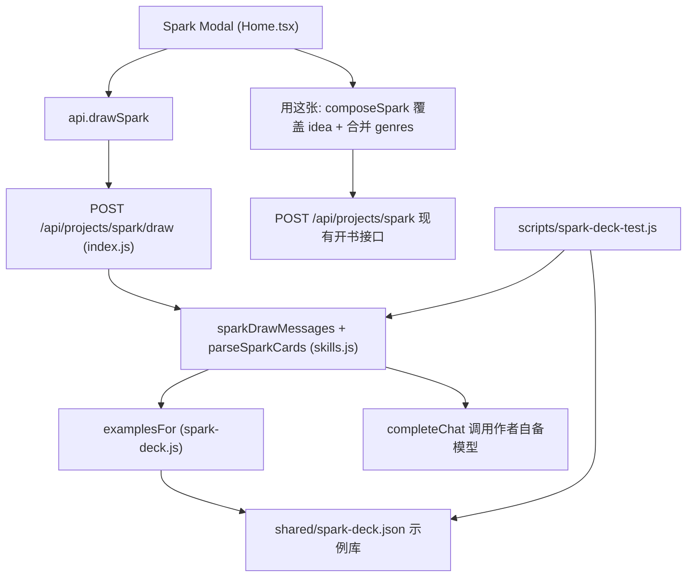

# 脑洞二次抽卡（Spark Card Draw）

Feature Name: spark-card-draw
Updated: 2026-09-18（迭代 2：由离线卡库改为模型基于作者脑洞生成三选一）

## Description

在首页「脑洞开新书」弹窗内提供「脑洞二次抽卡」。作者先在「脑洞与细节」输入框写一句脑洞或创意作为 Seed，选择「男频 / 女频 / 通用」频道后点「抽三个脑洞」，后端调用一次模型，基于 Seed 派生三张不同走向的开书方案卡（一句话核 + 核心冲突 + 金手指/身份抓手 + 2-4 条细节种子 + 类型标签）。前端把三张卡横向并列展示，作者点卡选中、点「用这张」将该方案合成可读中文覆盖写入 Seed 框，并把该卡标签并入 genres 偏好；点「换一批」重抽。抽卡本身不落库，开书仍走既有 `POST /api/projects/spark`。

内置的 28 张脑洞卡（`shared/spark-deck.json`）降级为提示词中的 few-shot 示例来源，不再直接展示给作者。

## Architecture



抽卡时前端只把 `idea`、`channel`、当前偏好快照发给后端；后端构造提示词（含按频道选取的两条示例）调用模型，解析并校验后返回三张卡。模型调用与前缀解析复用既有 `completeChat` 与 `parseSparkCards`，不新增持久化。

## Components and Interfaces

### `shared/spark-deck.json`（示例卡库）

```json
{
  "version": 1,
  "cards": [
    {
      "id": "m-001",
      "channel": "male",
      "tags": ["玄幻", "系统"],
      "hook": "一句核，交代主角处境与最大不公",
      "conflict": "核心冲突，一章内能演的对抗关系",
      "edge": "金手指或身份抓手",
      "details": ["细节种子一", "细节种子二", "细节种子三"]
    }
  ]
}
```

字段语义不变，仅作 few-shot 示例。首发下限：男频 ≥ 10、女频 ≥ 10、通用 ≥ 5。

### `backend/src/spark-deck.js`（示例选择）

```js
module.exports = {
  CHANNELS,          // ["male", "female", "common"]
  DECK_FILE,         // shared/spark-deck.json 绝对路径
  loadDeck(),        // 返回 { version, cards }；失败返回空卡库不抛错
  deckCards(channel),// common 只含 common；其余返回本频道 + common
  examplesFor(channel, count), // 取 count 条示例，本频道优先
};
```

### `shared/spark-dims.json` / `backend/src/spark-dims.js`（偏好维度唯一数据源）

`shared/spark-dims.json` 保存 11 个偏好维度（key/label/multiple/wide/hint/options），前端 `spark.ts` 与后端 `skills.js` 都从这里读取，避免两份候选清单漂移。

```js
module.exports = {
  DIMS, KEYS, MULTI_LIMIT,   // MULTI_LIMIT = 3
  dim(key), optionsFor(key), isMultiple(key), limitFor(key),
  optionBlock(),             // 供提示词列出每个维度与候选项
  normalizePicks(raw),       // 按维度白名单过滤，多选最多 3、单选最多 1，去重
};
```

### `backend/src/skills.js`（提示词与解析）

```js
function sparkDrawMessages(idea, prefs, channel);
function parseSparkCards(text, channel);
```

- `sparkDrawMessages(idea, prefs, channel)`：系统提示要求「只输出 JSON 数组、恰好 3 个对象、字段 hook/conflict/edge/details/tags/picks」，并强调「大开脑洞」——三张方案分属三个不同题材，世界观 / 金手指类型 / 冲突层级明显分岔，优先高概念、强反差、规则型设定与跨题材混搭，`hook` 25-60 字且结尾带反转；`tags` 1-3 个题材标签；`picks` 按维度给建议（可多选 1-3、单选 1），取值必须来自 `sparkDims.optionBlock()` 列出的候选项。提示内附两条 `examplesFor(channel, 2)` 示例；`prefs` 中已选维度与 `avoid` 一并带入。
- `parseSparkCards(text, channel)`：剥离代码围栏，接受裸数组或 `{cards:[...]}`；逐项过滤（hook/conflict/edge 非空、details ≥ 2 条非空、tags 最多 3 个），`picks` 经 `sparkDims.normalizePicks` 白名单过滤后仅在非空时挂到卡上；补齐 `id: card-N` 与 `channel`，最多取 3 张；无合法项时抛 `status=502`「模型没有返回可用的脑洞卡」。

### `backend/src/index.js`（接口）

`POST /api/projects/spark/draw`

```json
// 请求
{ "idea": "咸鱼编剧穿成糊咖……", "channel": "common", "prefs": { "genres": ["娱乐圈"], "avoid": [] } }
// 响应
{ "cards": [ { "id": "card-1", "channel": "common", "tags": ["娱乐圈"], "picks": { "genres": ["娱乐圈", "现言"], "romance": ["追妻火葬场"], "tones": ["轻松吐槽"] }, "hook": "…", "conflict": "…", "edge": "…", "details": ["…", "…"] } ] }
```

- `idea` 去空白后为空 → `400`「请先写一句脑洞或创意，再抽卡」。
- `channel` 非法或缺省 → 回落 `common`。
- 调用 `completeChat` 时 `temperature 1.05`、`timeout 120000`。

### `frontend/src/types.ts` / `frontend/src/spark-deck.ts`

```ts
export type SparkChannel = "male" | "female" | "common";
export type SparkCard = {
  id?: string;
  channel?: SparkChannel;
  tags: string[];
  picks?: Record<string, string[]>;
  hook: string;
  conflict: string;
  edge: string;
  details: string[];
};
export const SPARK_CHANNELS: { id: SparkChannel; label: string }[];
export function composeSpark(card: SparkCard): string;
```

`frontend/src/spark.ts` 另从 `@shared/spark-dims.json` 读取 `SPARK_DIMS`，并导出 `SPARK_MULTI_LIMIT = 3`、`applySparkPicks(prefs, picks)`；`toggleSparkPref`/`addSparkPref` 对可多选维度封顶 3 个。`composeSpark` 按「hook → conflict → edge → `· 细节`」拼成多行纯中文，不含字段名。

### `frontend/src/api.ts`

新增 `drawSpark(body: { idea: string; channel: SparkChannel; prefs?: unknown }): Promise<{ cards: SparkCard[] }>`，请求 `POST /api/projects/spark/draw`。

### `frontend/src/pages/Home.tsx`（Spark Modal）

状态：`channel`、`cards`、`selectedId`、`drawing`、`drawHint`。行为：

- `drawCards(nextChannel)`：Seed 为空时只设提示不发请求；否则置 `drawing`，调 `api.drawSpark`，成功则写入 `cards`、默认选中第一张，并自动并入第一张的全部标签与 `picks`；失败则清空卡片并显示错误。
- 渲染三张 `.spark-card`（`div[role=button]`，避免内嵌按钮）；`selectCard(item)` 设置 `selectedId` 并调 `prefsWithCard` 并入该卡全部标签与 `picks`；选中态加 `.on`；每张显示方案序号与标签。
- `prefsWithCard(cur, card)`：先 `tags → genres`（只增不减），再 `applySparkPicks` 按维度并入（多选封顶 3、单选不覆盖既有）；抽卡、切换选中、`adoptCard` 都复用它。
- 偏好板对可多选维度显示「最多选 3 个」，选满后禁用其余未选项；单选维度保持单选。
- 标签渲染为 `.spark-card-tag` 按钮：点击 `stopPropagation` 后只切换该标签（`toggleSparkPref`，已选取消、未选加入），不重复并入其他标签。
- `normTag()` 与 `addSparkPref` 同样做「折叠空白 + trim + 截断 48 字」，`pickTags()` 去重后返回；避免同一标签因空格差异重复计入或显示为未选中。
- `pickCard()` 取选中卡（回退第一张）；`adoptTags()` 把选中卡全部标签经 `addSparkPref(prefs, "genres", tag, true)` 并入 genres（只增不减）。
- `adoptCard(open)`：`composeSpark` 覆盖 `idea`、并入全部标签；`open` 为真时以「新 idea + 新 prefs」为参数直接调 `sparkNovel(idea, prefs)`，避免 `setState` 异步导致开书读到旧值。
- `sparkNovel(overrideIdea?, overridePrefs?)`：优先用传入的覆盖值，否则读当前 `idea`/`prefs`。
- 「换一批」复用 `drawCards()`；生成中禁用频道切换、抽卡、采纳标签、用这张、用这张并开书、开书与取消；`openSpark()` 时重置频道为 `common` 并清空卡片。

## Data Models

| 字段 | 类型 | 约束 |
|------|------|------|
| `id` | string | 后端补 `card-{序号}`；卡片 id 仅用于前端选中态 |
| `channel` | `male` / `female` / `common` | 后端按请求频道补齐 |
| `tags` | string[] | 1-3 项，写类型与元素，优先取 `SPARK_DIMS.genres` 已有选项，便于 `addSparkPref` 并入后显示为已选 |
| `picks` | Record<string, string[]> | 选填；键限 11 个偏好维度，值必须命中该维度候选项；可多选维度 1-3 个、单选维度 1 个，经 `normalizePicks` 过滤 |
| `hook` | string | 一句核，非空 |
| `conflict` | string | 核心冲突，非空 |
| `edge` | string | 金手指或身份抓手，非空 |
| `details` | string[] | 2-4 条，非空 |

## Correctness Properties

1. 一次抽卡返回的方案数不超过 3，且每张都通过字段校验。
2. `parseSparkCards` 对缺失必要字段的条目丢弃；全不合法时抛 502。
3. Seed 为空时不发起模型调用，返回 400。
4. `channel` 非法值一律按 `common` 处理。
5. `examplesFor(channel, n)` 优先返回本频道卡，不足才补 common；总数等于 min(n, 可用示例数)。
6. `composeSpark(card)` 以 `hook` 开头，包含 `conflict`、`edge` 与全部 `details`，不含 JSON 结构或占位符。
7. 「用这张」以选中方案覆盖 `idea`，并只增不减地合并 genres。
8. 抽卡成功与切换选中方案都会把对应方案的全部标签并入 genres（只增不减），并把 `picks` 按维度并入偏好；可多选维度合计不超过 3 个，单选维度不覆盖作者既有选择；请求进行中相关按钮全部禁用。
9. 点击方案标签即切换该标签在 genres 中的选中态，不影响同卡其他标签。
10. 「用这张并开书」以刚采纳的 `idea` 与 `prefs` 发起开书，不受 React 状态异步回写影响。
11. 标签比较前统一折叠空白并 trim，同一标签不会因空格差异重复出现或显示为未选中。
12. 提示词要求三张方案分属三个不同题材且世界观 / 金手指 / 冲突层级分岔，并引导高概念与跨题材混搭；`parseSparkCards` 每卡最多保留 4 个标签。

## Error Handling

- Seed 为空：前端不发请求，提示「先在上面写一句脑洞或创意，再抽卡」。
- 模型无有效输出 / 上游失败：接口返回 502 或上游错误码，前端清空卡片并在 `drawHint` 显示可读错误，弹窗仍可编辑与开书。
- 示例卡库读取失败：`loadDeck` 回落空卡库，提示词不含示例，抽卡照常。
- 开书生成中（`busy`）或抽卡中（`drawing`）：抽卡、用这张、开书、取消、频道切换均禁用。

## Test Strategy

1. `scripts/spark-deck-test.js`：校验 `shared/spark-deck.json` 结构（id 唯一、channel 合法、tags/details 数量、各频道下限）；校验 `spark-deck.js` 的 `deckCards`/`examplesFor` 频道语义；校验 `skills.js` 的 `parseSparkCards` 对围栏数组、裸数组、`{cards}` 包装、缺字段丢弃、超量截断与非法输入抛 502。
2. `scripts/pipeline-test.js`：确认流水线未受影响（34/34）。
3. `scripts/llm-mock-test.js`：确认 LLM 调用层未受影响（68/68）。
4. `npx tsc --noEmit`：校验 `spark-deck.ts`、`types.ts`、`api.ts` 与 Home.tsx 接入。
5. `npx vite build`：确认打包正常。
6. 接口冒烟：`POST /api/projects/spark/draw` 空 Seed 返回 400，非空可返回 `cards`（无真实模型时允许上游错误）。

## References

[^1]: (frontend/src/spark.ts) - 现有偏好维度定义与 `addSparkPref`
[^2]: (frontend/src/pages/Home.tsx) - 现有 Spark Modal 与 `sparkNovel()`
[^3]: (backend/src/index.js) - 现有 `POST /api/projects/spark` 开书接口与新增 `POST /api/projects/spark/draw`
[^4]: (backend/src/skills.js) - `sparkDrawMessages` / `parseSparkCards`
[^5]: (shared/spark-deck.json) - 28 张 few-shot 示例卡
