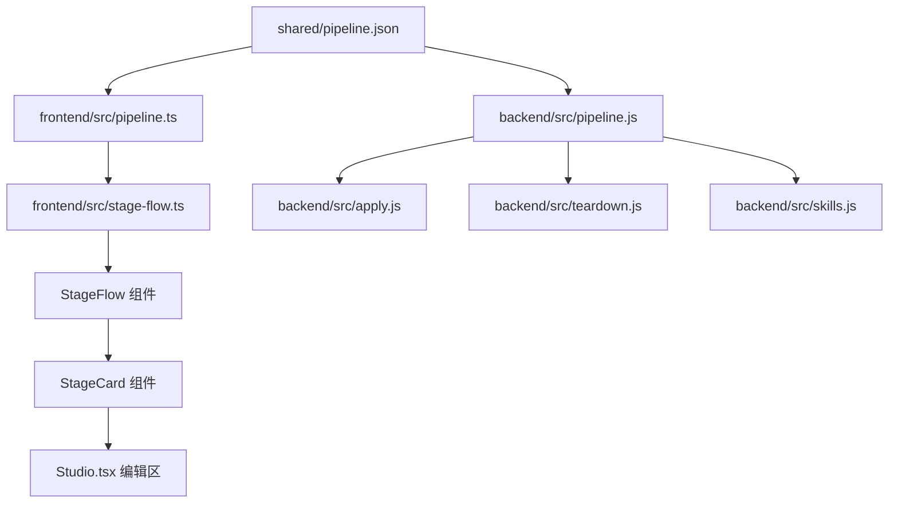

# 主台流程重设计（纵向阶段卡片流）— 技术设计

- 特性编号：2026-09-18-studio-flow-redesign
- 关联需求：同目录 `requirements.md`
- 关联特性：`2026-09-18-skill-pipeline`（流水线单一数据源）

## 1. 设计目标

1. 把「阶段是什么、产出到哪、依赖谁、怎么操作」全部收敛到 `shared/pipeline.json`，前后端只读这一份定义。
2. 修掉 P0–P2 的「流水线与 Skill 对不上」问题。
3. 主台改为纵向阶段卡片流：一屏内按顺序看完所有阶段及其状态/产出/依赖/操作。

## 2. 总体架构



单一数据源分层：

- `pipeline.json`：声明式定义（阶段顺序、字段、模式、依赖、UI 文案）。
- 后端 `pipeline.js`：加载 + 校验 + 纯函数查询。新增 `stageBySkill`、`fieldOf`、`modeOf`、`depsOf`、`refsOf`、`stageByField`。
- 前端 `pipeline.ts`：复用同一 JSON，导出派生视图。
- 前端 `stage-flow.ts`（新增）：把「阶段定义 + 小说数据 + 任务状态」推导为 `StageCardModel[]`，纯函数、可单测。
- `StageFlow` / `StageCard`（新增组件）：纯展示 + 回调，不含业务规则。

## 3. 数据模型

### 3.1 `pipeline.json` schema v2（向后兼容，缺省即旧行为）

在现有 stage 字段上新增：

| 字段 | 类型 | 说明 |
| --- | --- | --- |
| `field` | string | 产出落到的字段名。novel 字段或 chapter 字段；`content` 特殊。 |
| `scope` | `"novel" \| "chapter" \| "teardown"` | 决定 `field` 挂在哪个对象上。 |
| `mode` | `"replace" \| "append"` | 覆盖或追加。`chapter-prose=replace`，`continue=append`。 |
| `deps` | string[] | 前置阶段 id，用于卡片依赖展示与顺序校验。 |
| `refs` | string[] | 本阶段产出的关联类型：`characters`/`props`/`threads`/`beats`。 |
| `editable` | boolean | 卡片是否提供「编辑产出」入口。 |

关键修正：

- `review`：`field: "reviewReport"`, `scope: "chapter"`, `mode: "replace"`。
- `suggest`：`field: "advice"`, `scope: "chapter"`, `mode: "replace"`（**不再与 review 共用一个字段**，且不再被 `skipApply` 丢弃）。
- `td-imitate`：`target: "td-imitate"`（与 `td-craft` 解耦）；`field: "imitate"`。
- `td-craft`：`field: "recipes"`（补上此前缺失的 field）。
- `continue`：补 `artifact: "content"`、`mode: "append"`。
- `props` 阶段：`deps: ["outline"]`，仍为 `auto`，顺序排在正文后（与 `kickoff.md` 描述对齐）。

### 3.2 章节新增字段

`chapter.advice: string`（卡壳建议）。旧的 `reviewReport` 语义保持不变。migrate 缺失时补空串。

## 4. 后端改动

### 4.1 `pipeline.js`

新增纯函数（供 `apply.js`/`teardown.js`/`skills.js` 共用）：

- `stageBySkill(skill)`：先 `id → builtin`，再 `target`，再 `inject`（与前端 `stageOf` 同语义）。
- `fieldOf(stage)` / `modeOf(stage)` / `depsOf(stage)` / `refsOf(stage)`。
- `writingSkillIds()`：替代 `skills.js` 里写死的 `WRITING_INJECT`。
- `teardownTabs()`：从拆书线 stage（含 `field`/`tab`）派生 `TAB_FIELDS`，`SKILL_FIELD` 由 `builtin → field` 派生。

校验增强：加载时若同一 `line` 内 `target` 重复则直接报错（防止 P0-3 回归）。

### 4.2 `apply.js`

把 `applyGenerated` 改为「按 stage 派发」：

```
stage = stageBySkill(skill)
if (!stage) 保持旧逻辑兜底
switch (stage.scope):
  novel:    upsert(或 append) 到 next[stage.field]
  chapter:  chapter[stage.field] = output（append 时拼接）
  teardown: 委托 teardown.applyTeardownOutput
content 特殊分支保留：cleanProse + chapter-prose 的 clipToWordMax
```

`chapter-prose` → `mode: replace` 整章替换；`continue` → `mode: append` 追加章尾。

### 4.3 `index.js`

- 删除 `skipApply` 里的 `skill.id === "suggest"`（polish 仍跳过，因其产出由前端显式应用）。
- `applyMode` 优先取 stage 定义：`mode || stage.mode || (continue ? append : replace)`。

### 4.4 `teardown.js`

- 删除写死的 `TAB_FIELDS` / `SKILL_FIELD`，改由 `pipeline.teardownTabs()` 派生（P2-10）。
- `applyTeardownOutput` 直接读 `stage.field`。

### 4.5 `skills.js`

`WRITING_INJECT` 写死清单改用 `pipeline.writingSkillIds()`（P2-8）。

## 5. 前端改动

### 5.1 `pipeline.ts`

- 类型补 `field/scope/mode/deps/refs/editable`。
- 删除死代码 `STEPS` / `QUICK_STAGES`（P2-7）；`PIPELINE` 保留给自动流水线任务，但由 `AUTO_STAGES` 派生。
- `pipeSkillSlot` 继续用 `builtin → artifact`。

### 5.2 新增 `stage-flow.ts`

```ts
export type StageStatus = "todo" | "active" | "done" | "failed" | "skipped";
export type StageCardModel = {
  stage: PipelineStage;
  status: StageStatus;
  produced: { label: string; preview: string }[];
  deps: { id: string; label: string; satisfied: boolean }[];
  refs: { kind: string; label: string; count: number }[];
  actions: ("run" | "rerun" | "skip" | "edit" | "view")[];
};
export function buildStageFlow(novel, chapter, job, line): StageCardModel[];
```

状态推导：产出字段非空 → `done`；当前 job 命中该 stage → `active`；job 失败记录命中 → `failed`；用户跳过集合命中 → `skipped`；否则 `todo`。

### 5.3 新增组件 `StageFlow` / `StageCard`

- 纵向 flex 列，`StageCard` 展示：序号/阶段名/状态徽标、产出摘要、依赖 chips、关联 chips、操作按钮区。
- 当前阶段自动滚动进视口（`scrollIntoView({ block: "nearest" })`）。
- 自动流水线运行时，卡片内联进度（已用时/预计/字数）。

### 5.4 `Studio.tsx`

- 顶部进度条 + 左栏手写 `TABS` 改为 `<StageFlow>`（P2-7、P1-6）。
- 编辑区保留：点击卡片「编辑/查看」打开对应资产编辑器；tab 顺序从 `pipeline.json` 的 `ui.tab` 派生。
- `modeFor()` 改为读 stage 定义（P0-2）。
- 审稿/卡壳建议落字段改为 `reviewReport` / `advice`（P0-1）。
- 拆书台 `TEAR_TABS` / `TAB_FIELDS` 改用 pipeline 派生（P2-10）。

## 6. 兼容与迁移

- `schema.js` 的 novel migrate 增加 `chapter.advice = ""`。
- 旧数据缺 `field` 时按 target 兜底，保证升级后可读。
- Skill `id` 不变；`frontmatter.order` 仅用于同阶段内排序，本次对齐到 pipeline 顺序（P1-5）。

## 7. 测试

| 测试 | 覆盖 |
| --- | --- |
| `scripts/pipeline-test.js` | schema v2 校验、重复 target 报错、`stageBySkill`/`fieldOf`/`modeOf`、teardown 派生 |
| `scripts/apply-test.js`（新增） | review/suggest 分字段、chapter-prose replace、continue append、td-imitate/td-craft 分字段 |
| `scripts/stage-flow-test.js`（新增） | 状态推导、依赖满足、refs 计数 |
| `scripts/llm-mock-test.js` | 回归 68/68 |
| `npx tsc --noEmit` / `npx vite build` | 前端类型与构建 |

## 8. 实施顺序

1. schema v2 + `pipeline.json` 修正（P0-3、continue artifact、field/scope/mode/deps）。
2. 后端 `pipeline.js` 访问器 + 校验；`apply.js` 派发；`index.js` 去 skipApply(suggest)。
3. `teardown.js` / `skills.js` 收敛。
4. `apply-test` 绿灯。
5. 前端 `stage-flow.ts` + 测试。
6. `StageFlow`/`StageCard` 组件 + `Studio.tsx` 接入。
7. 全量回归 + 文档同步。

## 附录：问题证据

| 编号 | 位置 | 现象 |
| --- | --- | --- |
| P0-1 | `backend/src/index.js:877`、`frontend/src/pages/Studio.tsx:1719` | `suggest` 被 `skipApply` 丢弃，前端却写入审稿字段 |
| P0-2 | `skills/builtin/chapter-prose.md:165`、`Studio.tsx:1643`、`backend/src/apply.js:61` | 说明书要求续写，代码固定 replace |
| P0-3 | `shared/pipeline.json:236-249`、`backend/src/pipeline.js:60` | td-imitate/td-craft target 撞车，先到先得 |
| P1-4 | `skills/builtin/kickoff.md:122` | 自动流程漏「道具」阶段 |
| P1-5 | Skill frontmatter `order` | 与 pipeline 顺序不一致 |
| P1-6 | `Studio.tsx` 左栏 TABS | 道具排第 4，pipeline 排最后 |
| P2-7 | `frontend/src/pipeline.ts:133` | `STEPS`/`quick` 死代码 |
| P2-8 | `backend/src/skills.js` | 写死写作类清单 |
| P2-9 | `pipeline.json continue` | 缺 `artifact` |
| P2-10 | `backend/src/teardown.js:11-32` | `TAB_FIELDS`/`SKILL_FIELD` 各自维护 |
