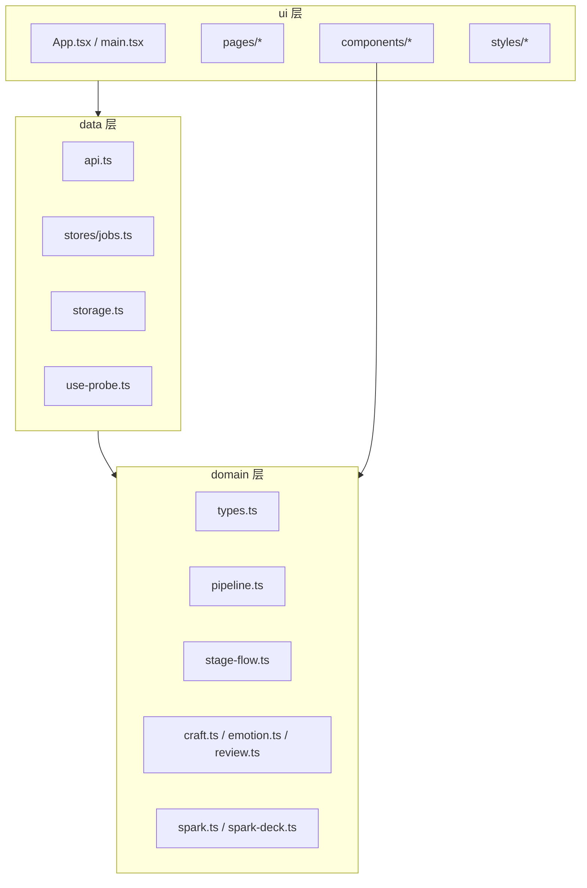
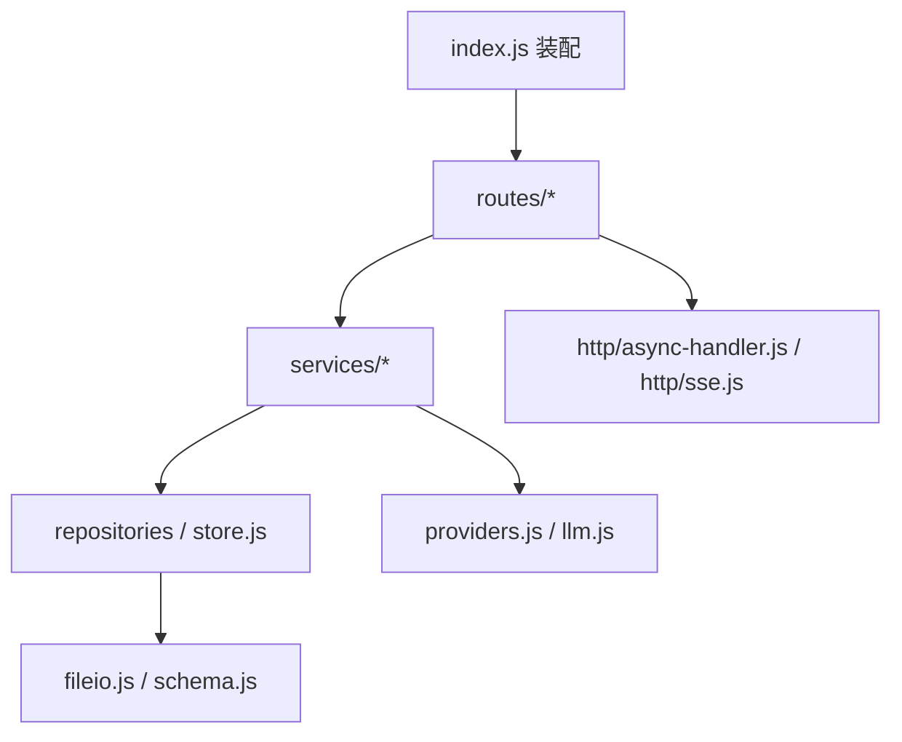

# 代码架构重组 — 技术设计

- 特性编号：2026-09-21-architecture-modularization
- 关联：`2026-09-18-skill-pipeline`（pipeline 单一数据源）、`2026-09-18-studio-flow-redesign`（阶段卡片流）、`2026-09-19-studio-workbench`（双栏持久工作台）
- 约束：保持现有技术栈，纯内部重组；行为、接口、数据格式、依赖全部不变

## 1. 现状与问题

### 1.1 量化现状

| 位置 | 规模 | 主要问题 |
|---|---|---|
| `frontend/src/pages/Studio.tsx` | 4570 行 / 56 `useState` / 24 `useEffect` / 23 个 ref | 数据、运行、编辑、扫描、布局、弹层耦合在一个组件 |
| `frontend/src/styles.css` | 3602 行 / 799 选择器块 / 5 媒体块 / 3 断点 | 无分区、无间距圆角 token、响应式分散、4 处未定义变量、1 处孤儿规则 |
| `backend/src/index.js` | 1127 行 / 74 路由 | handler 全内联，路由混业务编排与 LLM 调用 |
| `backend/src/skills.js` | 1444 行 | 八类职责（CRUD/历史/排序/导入导出/提示词/Spark/工厂/正文变换）耦合 |
| 界面映射 | `shared/pipeline.json` + `pipeline.ts` + `Studio.tsx` + `teardown-run.ts` | 阶段到面板的映射有四处副本 |

### 1.2 关键耦合事实

- `index.js` 各处 `try/catch` 提前消费错误，`app.get("*")` 之外的全局错误中间件（1105-1117）实际不可达。
- `Studio.tsx` 的全部 hook 位于加载早退（2100-2126）之前，且 722-726、1405、2613、2061-2079 是每帧刷新的命令式接线；拆分的核心风险集中在这里。
- `store.js` 的 `ROOT`/`CUSTOM_SKILL_DIR` 被 `skills.js`、`elements.js`、`voice.js`、`teardown.js`、`pipeline.js`、`spark-deck.js` 直接引用，是仓储边界的隐含出口。
- `styles.css` 大量依赖「后定义覆盖同特异性前定义」，拆分必须保持行号顺序。

## 2. 目标结构

### 2.1 分层与依赖方向





层方向由守卫脚本静态检查，反向导入视为失败。

### 2.2 前端目录

```
frontend/src/
  main.tsx  App.tsx  ErrorBoundary.tsx
  domain/
    types.ts            # 原 types.ts
    pipeline.ts         # 原 pipeline.ts + 界面映射单源
    stage-flow.ts       # 原 stage-flow.ts
    craft.ts  emotion.ts  review.ts  model-groups.ts
    spark.ts  spark-deck.ts
  data/
    api.ts              # 原 api.ts
    storage.ts          # 新增：moshu.* 键常量 + 读写封装
    jobs.ts             # 原 jobs.ts
    use-probe.ts
  components/
    StageFlow.tsx  StageRail.tsx  Meter.tsx  ModelPicker.tsx
    ProbeBadge.tsx  PromptPreview.tsx  ReviewReport.tsx  CommandPalette.tsx
    ui/IssueList.tsx  ui/AigcCard.tsx  ui/InsFold.tsx  ui/ConfigBanner.tsx
  pages/
    Home.tsx  Skills.tsx  Voice.tsx  Settings.tsx
    Teardown.tsx  TeardownDesk.tsx
    studio/
      Studio.tsx            # 编排层，333 行（≤ 400）
      studio-utils.ts       # 纯函数与常量，零 React
      view-types.ts         # 五个 hook 的 ReturnType 别名
      derive.ts             # deriveStudio：44 项派生值单源
      canvas-act.tsx        # 画布处理器纯工厂（7 个）
      file-acts.ts          # 导出/归档/复制/彻底删除纯工厂
      useStudioPage.ts      # 页面级副作用 + load
      useStudioDocument.ts
      useStudioPipeline.ts
      useStudioScan.ts
      useStudioAssets.ts
      useStudioUi.ts
      views/
        StudioToc.tsx  StudioCanvas.tsx
        StudioInspector.tsx  StudioModals.tsx  AssetCard.tsx
  styles/
    index.css
    00-tokens.css 01-shell.css 02-picker.css 03-workspace.css
    04-stage-rail.css 05-stage.css 06-controls-assets.css 07-reader.css
    08-inspector-craft.css 09-home.css 10-skills.css 11-history-bind.css
    12-board-review.css 13-studio-responsive.css 14-teardown.css
    15-voice-import.css 16-prompt-preview.css
```

顶层 `src/*.ts(x)` 迁移到 `domain/`、`data/`，属机械移动，需同步全部导入路径。

### 2.3 后端目录

```
backend/src/
  index.js                 # 仅装配，目标 ≤ 200 行
  http/
    async-handler.js       # asyncHandler + ApiError
    sse.js                 # openSse / writeSse / abortOnClose
  middleware/
    auth.js                # cookie 解析、authOk、/api 鉴权与放行
  routes/
    auth.js settings.js projects.js skills.js
    elements.js voice.js generate.js teardowns.js
  services/
    project-service.js
    project-import-service.js
    prompt-service.js                # /api/prompt/preview
    generation-service.js            # /api/generate
    teardown-generation-service.js   # /api/teardowns/:id/generate
    spark-service.js
    voice-service.js
    proof-service.js
    settings-service.js
  skills/
    core.js history.js io.js order.js factory.js craft.js author.js index.js
  # 原 domain 模块保持原位：store.js pipeline.js prompt.js apply.js
  # context.js quality.js craft.js imitate.js genre.js beats.js review.js
  # aigc.js baseline.js emotion.js providers.js llm.js env.js
  # fileio.js schema.js importers.js elements.js teardown.js teardown-context.js
  # spark-deck.js spark-dims.js
```

## 3. 前端拆分设计

### 3.1 Studio 拆分映射

| 源区间（Studio.tsx） | 目标模块 | 内容 |
|---|---|---|
| 40-46、66-169、253-560、562-585 | `studio-utils.ts` | 纯函数、常量、`readJson`、`shortcutK` |
| 48-64、498、574-580 | `studio-utils.ts` / `studio-tabs.ts` | `TabId`/`DeskId`/`FillSlot`/`UndoSnap` 类型；`TABS`/`RAIL_EXTRAS` 改为派生 |
| 171-207、215-251、587-609、4562-4570 | `components/ui/*` | `IssueList`/`AigcCard`/`InsFold`/`ConfigBanner` |
| 611-781、1119-1503 | `useStudioDocument.ts` | novel/chapter/skills、patch 系列、save、冲突、undo |
| 783-1046（数据与持久化部分） | `useStudioDocument.ts` / `useStudioUi.ts` | 按副作用归属拆分 |
| 1517-2613（运行部分） | `useStudioPipeline.ts` | `runSkill`、autoPipe、fillSlot、stageAction、pipeControls |
| 1214-1277、1977-2000 | `useStudioScan.ts` | scan/issue/polish/emotion |
| 1125-1201、1291、2002-2059、2794-2943 | `useStudioAssets.ts` + `components/AssetCard.tsx` | 资产卡、词库、仿写、上传 |
| 619-694（布局类） | `useStudioUi.ts` | tab/desk/mobile/split/rail/palette/preview/focus |
| 2945-3012 | `components/StudioToc.tsx` | 目录 + 移动端 tabs |
| 3031-3685 | `components/StudioCanvas.tsx` | 画布（动作卡、面板、阅读器） |
| 3687-4451 | `components/StudioInspector.tsx` | 检查器全部折叠块 |
| 4453-4557 | `components/StudioModals.tsx` | 文件输入、历史、日志、命令面板、zen、提示词预览 |
| 2100-2126、2945、4558 | `Studio.tsx` | 加载早退、布局骨架、hooks 组合 |

### 3.2 状态归属

| hook | 持有状态 |
|---|---|
| `useStudioDocument` | `novel` `skills` `chapterId` `loadError` `dirty` `undoStack` `status` `imitRows` + `chapter` 派生 |
| `useStudioPipeline` | `busy` `autoPipe` `paused` `failed` `runningSlot` `skippedStages` `selectedStageId` `streamChars` `pipeClock` `workName` `workId` |
| `useStudioScan` | `issues` `aigc` `voiceInfo` `nouns` `ignored` `reportOpen` `logsOpen` `sideText` `sideKind` |
| `useStudioAssets` | `folds` `allSkills` `imitBusy` `histFor` |
| `useStudioUi` | `tab` `desk` `mobile` `split` `extra` `reading` `readerSize` `nightRead` `railCollapsed` `railFoldedGroups` `paletteOpen` `paletteQuery` `previewOpen` `previewSkillId` `focusOpenFor` `focusDraft` `nameHint` `dragId` `selText` `keepDraft` `mapFrom` `mapTo` `ctx` |

`job` 来自 data 层 `jobs.ts`，不进 hook 状态。

### 3.3 hooks 边界与命令式接线

- 全部 hook 文件返回普通对象，调用点位于 `Studio.tsx` 顶部，无条件执行。
- 每帧刷新保持在这些 hook 内同步执行（非 `useEffect`）：`novelRef`、`busyRef`、`dirtyRef`、`idRef`、`undoStackRef`、`saveRef`、`continueAutoPipeRef`。
- `stageNavRef` 与全局快捷键两个 effect 保留在 `Studio.tsx` 顶部，位于加载早退之前。
- hook 之间通过**显式入参**传递依赖（`useStudioPipeline({ document, ui, job })`），不依赖模块级单例，避免测试时串状态。
- `useStudioDocument` 暴露 `novelRef` 为唯一写入口，`patchNovel` 只写 ref 与 state，与现状一致。

### 3.4 组件拆分与 props 约定

- 展示组件禁止直接调用 `api.*` 与 `localStorage`；数据与回调由容器传入。
- 五个 hook 暴露的对象统一命名为 `doc` / `ui` / `scan` / `assets` / `act`，派生值单源对象为 `d`（`deriveStudio`）。
- `StudioCanvas` 接收 `{ doc, ui, scan, assets, act, d, job, zen, setZen, canvas, paperRef, readerShellRef }`；`canvas` 为 `createCanvasAct` 返回的 7 个画布处理器集合（`onStageAction`/`toggleFocusEdit`/`saveFocusEdit`/`pipeControls`/`captureNameHint`/`applyNameHint`/`captureSel`）。
- `StudioInspector` 接收 `{ doc, ui, scan, assets, act, d, pipeControls }`。
- `StudioModals` 接收 `{ doc, ui, scan, assets, act, d, zen, setZen, files }`；`files` 为 `createStudioFiles` 返回的导出/归档/复制集合，命令面板条目在组件内构建。
- `StudioToc` 接收 `{ doc, ui, act }`。
- `AssetCard` 接收单张卡的 `{ doc, assets, act, d, field, card, index }`；卡内读写经 `assets.writeCard` 与 `doc.patchNovel` 完成。
- 画布/文件/页面副作用分别落在 `canvas-act.tsx`（纯工厂，无 hook）、`file-acts.ts`（纯工厂）、`useStudioPage.ts`（页面级副作用 + `load`）内；三者均为无状态封装，避免容器膨胀。

### 3.5 界面映射单源

在 `domain/pipeline.ts` 内新增/保留：

- `WRITING_GROUPS`：阶段分组（已存在，加载期校验）。
- `panelOfStage`：阶段 → `{desk, tab}`（已存在，作为唯一映射函数）。
- `LORE_TABS` / `INSPECTOR_TABS` / `DESK_EXTRA_ENTRIES`：由 `STAGES` 的 `ui.tab` / `ui.desk` 派生。
- `teardown-run.ts` 的 `TEAR_TABS` 继续由 `TEARDOWN_TABS` 派生（已满足）。

`Studio.tsx` 的 `TABS` 与 `RAIL_EXTRAS` 改为从上述派生，禁止再写硬编码阶段清单；派生结果由守卫测试与基线比对。

## 4. 前端存储收敛

新增 `data/storage.ts`：

```ts
export const STORAGE_KEYS = {
  last: "moshu.last",
  lastTeardown: "moshu.lastTeardown",
  readerSize: "moshu.readerSize",
  nightRead: "moshu.nightRead",
  railCollapsed: "moshu.railCollapsed",
  railFolded: "moshu.railFolded",
  folds: "moshu.folds",
  ch: (novelId: string) => `moshu.ch.${novelId}`,
  ui: (novelId: string) => `moshu.ui.${novelId}`,
  skipNovel: (novelId: string) => `moshu.skip.novel.${novelId}`,
  skipChapter: (novelId: string, chapterId: string) => `moshu.skip.chapter.${novelId}.${chapterId}`,
  tdSkip: (teardownId: string) => `moshu.tdskip.${teardownId}`,
} as const;
```

配套 `readJson/writeJson/readText/writeText/remove` 封装。键值字符串与现状一致，`App.tsx`、`Studio.tsx`、`TeardownDesk.tsx`、`api` 调用点改为引用常量。

## 5. 样式拆分

### 5.1 文件与源区间

| 文件 | 源区间 | 行数 |
|---|---|---|
| `00-tokens.css` | 1-62 | 66（含 R19 新增 4 行 token） |
| `01-shell.css` | 64-136 | 73 |
| `02-picker.css` | 138-525 | 388 |
| `03-workspace.css` | 527-615 | 89 |
| `04-stage-rail.css` | 616-765 | 150 |
| `05-stage.css` | 766-1142 | 377 |
| `06-controls-assets.css` | 1144-1258 | 115 |
| `07-reader.css` | 1260-1441 | 182 |
| `08-inspector-craft.css` | 1442-1585 | 144 |
| `09-home.css` | 1586-2022 | 437 |
| `10-skills.css` | 2023-2286 | 264 |
| `11-history-bind.css` | 2288-2563 | 276 |
| `12-board-review.css` | 2565-2899 | 335 |
| `13-studio-responsive.css` | 2901-3146 | 246 |
| `14-teardown.css` | 3148-3344 | 198 |
| `15-voice-import.css` | 3346-3531 | 186 |
| `16-prompt-preview.css` | 3533-3602 | 70 |

### 5.2 层叠约束

- `styles/index.css` 仅含按上表顺序的 `@import`，`main.tsx` 改为 `import "./styles/index.css"`。
- 拼接顺序必须等同原文件行号顺序；`@media (max-width:1180px)`（761）留在 `04`，`@media (max-width:860px)`（1841）留在 `09`，不汇总。
- 区间之间的分隔空行归属前一个文件（保证拼接字节序完全等同原文件），实现时以源文件整行切片。
- R20 的修复：`.trio` 从 3146 移入 960 媒体块、拆开 3335 单行双规则、修正 2764-2809 缩进。修复与拆分同批落地，守卫以白名单吸收修复差异。
- 守卫测试 `scripts/css-order-test.mjs` 用花括号感知的规则解析器比对「按入口顺序拼接的规则序列 = 基线」，并白名单 `:root`（R19）与孤儿 `.trio`（R20，空白/缩进差异由归一化吸收）；另断言 `.trio` 恰好一条且位于 `@media (max-width: 960px)` 内。基线文件为 `scripts/fixtures/styles-baseline.css`。

## 6. 后端拆分设计

### 6.1 http 基础设施

```js
// http/async-handler.js
class ApiError extends Error { constructor(status, message, extra = {}) { ... } }
function asyncHandler(fn) { return (req, res, next) => Promise.resolve(fn(req, res, next)).catch(next); }
```

`ApiError.extra` 承载 `{code}` / `{conflict, currentRev}` / `{ok:false}` 等既有特例。全局错误中间件读取 `status` 与 `extra`，保持响应形态。

```js
// http/sse.js
function openSse(res, meta) { /* 三个 header + flushHeaders + writeSse(meta) */ }
function writeSse(res, payload) { /* 原 730-733 */ }
function abortOnClose(res, controller) { /* 原 res.on("close") 语义 */ }
```

### 6.2 路由 → 服务映射

| 路由文件 | 端点 | 服务 |
|---|---|---|
| `auth.js` | `/api/login` `/api/auth` `/api/health` | 无（`middleware/auth.js` 复用） |
| `settings.js` | `/api/settings*` | `settings-service`（probe 编排） |
| `projects.js` | `/api/projects*` `/api/imitate/*` | `project-service` `project-import-service` `spark-service` `proof-service` |
| `skills.js` | `/api/skills*` `/api/pipeline` | `skills/*` |
| `elements.js` | `/api/elements*` | `elements.js` |
| `voice.js` | `/api/voice*` | `voice-service` |
| `generate.js` | `/api/prompt/preview` `/api/generate` | `prompt-service` `generation-service` |
| `teardowns.js` | `/api/teardowns*` | `teardown-generation-service`（生成）；CRUD 直接走 `../teardown` |

`index.js` 装配顺序：`cors` → `json` → `middleware/auth`（挂 `/api`，放行名单内置于 middleware）→ 各 router → 静态 → SPA 兜底 → 404 → 错误中间件 → `listen`。

### 6.3 skills 拆分

| 模块 | 源区间 | 职责 |
|---|---|---|
| `skills/core.js` | 9、11-192、272 | 常量、ID 安全、front-matter、读取投影、序列化 |
| `skills/history.js` | 274-378 | 版本历史读写与恢复 |
| `skills/factory.js` | 1031-1253、1256-1287 | 出厂备份、对标段落、注入聚合、`skillPromptBody`、`toPublicSkill` |
| `skills/io.js` | 194-270、534-630、1289-1353 | CRUD、克隆、导入导出、Markdown 互转 |
| `skills/order.js` | 380-532 | 内置元数据、排序与持久化 |
| `skills/craft.js` | 631-668、1355-1406 | 拆书法覆盖层、技法 Skill 写入 |
| `skills/author.js` | 670-1029 | Skill / Spark 的作者提示词与解析 |
| `skills/index.js` | 仅 barrel | 汇总再导出（35 项，与旧 `skills.js` 一致） |

依赖方向 `core → history → io → order`、`factory`、`craft`、`author`，无环；`toPublicSkill` 置于 `factory`，使 `io.importSkillMarkdown` 可复用而不产生 io↔index 循环。

保持 `skills/index.js` 汇总再导出，调用点（`routes/skills.js`、`routes/projects.js`、`routes/teardowns.js`、`services/*`、`prompt.js`、`teardown-context.js`、`pipeline.js`）不改。

### 6.4 契约冻结

- `store.js` 的 `ROOT` / `CUSTOM_SKILL_DIR` 常量出口保留。
- `store.saveNovel` 的 `expectedRev` 409 与 `data/conflicts` 快照保留。
- SSE 的 `settingsReady`、header 顺序、`writableEnded` 判定保留。
- schema 迁移链与 `stamp` 调用点保留。

## 7. 数据模型

本特性不新增业务数据字段。新增的内部类型：

```ts
// studio-tabs.ts
export type StudioDeskId = "write" | "lore" | "board" | "cast" | "threads";
export type StudioTabId = "brief" | "characters" | "world" | "props" | "outline" | "beats" | "content";
export type StudioActions = { /* useStudioPipeline 暴露的操作签名 */ };
```

`frontend/domain/types.ts` 与后端 `shared/*.json` 的字段保持不变。

## 8. 正确性属性

1. **接口冻结**：74 条路由的方法、路径、成功与失败响应字段与重组前一致。
2. **存储冻结**：全部 `moshu.*` 键值与语义一致，无新增、无重命名。
3. **层方向**：`ui → data → domain` 单向，`routes → services → store/domain` 单向，守卫脚本零违规。
4. **样式等价**：样式文件按序拼接的规则序列等于基线，修复点需在白名单内。
5. **hooks 稳定**：所有 hook 在提前返回前无条件调用，命令式接线每帧刷新。
6. **预算约束**：`Studio.tsx ≤ 400`、样式单文件 `≤ 500`、技能模块 `≤ 400`、路由文件 `≤ 300`、`index.js ≤ 200`。
7. **依赖冻结**：`package.json` 依赖与版本不变。

## 9. 错误处理

- 前端保持现有 `ApiError`/`ConflictError` 分支与 `ErrorBoundary` 行为；接口外部形态不变。
- 后端 `ApiError.extra` 覆盖特例：`{ok:false}`、`{error, code}`、`{error, conflict, currentRev}`。
- `asyncHandler` 把未捕获异常交给全局错误中间件，保留 `headersSent` 时只 `end()` 的行为。
- 迁移期间发现的行为差异视为缺陷，记录到 `.monkeycode/reports/` 后修复，不做静默兼容。

## 10. 测试策略

### 10.1 新增守卫脚本

| 脚本 | 检查 |
|---|---|
| `scripts/architecture-test.mjs` | 行数预算、层方向（解析 import）、存储键常量收敛（无裸 `localStorage` 字符串键）、映射单源（无重复硬编码阶段清单） |
| `scripts/api-contract-test.js` | 启动 app 后枚举 `app._router` 栈，与 `scripts/fixtures/api-contract.json` 基线比对方法/路径/数量 |
| `scripts/css-order-test.mjs` | 依次读取 `styles/*.css` 拼接，与 `scripts/fixtures/styles-baseline.css` 比对（修复点白名单） |
| `scripts/deps-lock-test.js` | 比对 `package.json` 依赖快照 |

### 10.2 既有回归

`pipeline-test` 34/34、`apply-test` 16/16、`stage-flow-test` 29/29、`spark-deck-test` 26/26、`llm-mock-test` 68/68、`tsc --noEmit` 0、`vite build` 成功。

### 10.3 页面冒烟

扩展 `/tmp/opencode/harness.cjs`：对 `/`、`/studio/:id`（阅读态、编辑态）、`/teardown/:id`、`/voice`、`/skills`、`/settings` 逐页渲染，断言 `ERRORS[0]` 且关键类名存在。

## 11. 迁移阶段

| 阶段 | 内容 | 风险 | 回退 |
|---|---|---|---|
| P1 | 新增守卫脚本与基线快照（先冻结契约） | 低 | 删除脚本 |
| P2 | `domain/` `data/` 目录迁移 + `storage.ts` 收敛 | 中（导入路径） | 单提交回退 |
| P3 | `Studio.tsx` 纯函数与展示组件抽取 | 低 | 单提交回退 |
| P4 | `Studio.tsx` 五个 hooks 抽取 | 高（hooks 顺序、闭包、接线） | 单提交回退 |
| P5 | 画布/检查器/目录/弹层组件抽取，`Studio.tsx` 收口 | 中 | 单提交回退 |
| P6 | 样式拆分 + R19/R20 修复 | 中（层叠顺序） | 单提交回退 |
| P7 | 后端 `http/` `middleware/auth` 抽取 | 中（鉴权覆盖、错误形态） | 单提交回退 |
| P8 | 后端 `routes/` 拆分 | 中（挂载顺序） | 单提交回退 |
| P9 | 后端 `services/` 与 `skills/` 拆分 | 高（SSE、rev、迁移） | 单提交回退 |
| P10 | 界面映射单源收口、文档与 CHANGELOG 同步 | 低 | 单提交回退 |

每个阶段结束执行：既有回归 + 守卫脚本 + 页面冒烟；任一失败先按既有报错流程记录到 `.monkeycode/reports/`，修复并二次复查后再进入下一阶段。

## 12. 参考

[^1]: (File) - `frontend/src/pages/Studio.tsx`
[^2]: (File) - `frontend/src/styles.css`
[^3]: (File) - `frontend/src/pipeline.ts`
[^4]: (File) - `frontend/src/jobs.ts`
[^5]: (File) - `frontend/src/app-state.tsx`
[^6]: (File) - `frontend/src/main.tsx`
[^7]: (File) - `backend/src/index.js`
[^8]: (File) - `backend/src/skills.js`
[^9]: (File) - `backend/src/store.js`
[^10]: (File) - `shared/pipeline.json`
[^11]: (File) - `scripts/stage-flow-test.mjs`
[^12]: (File) - `scripts/apply-test.js`
