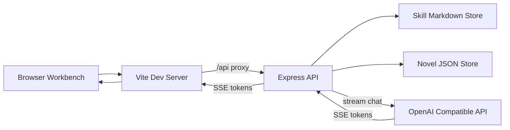
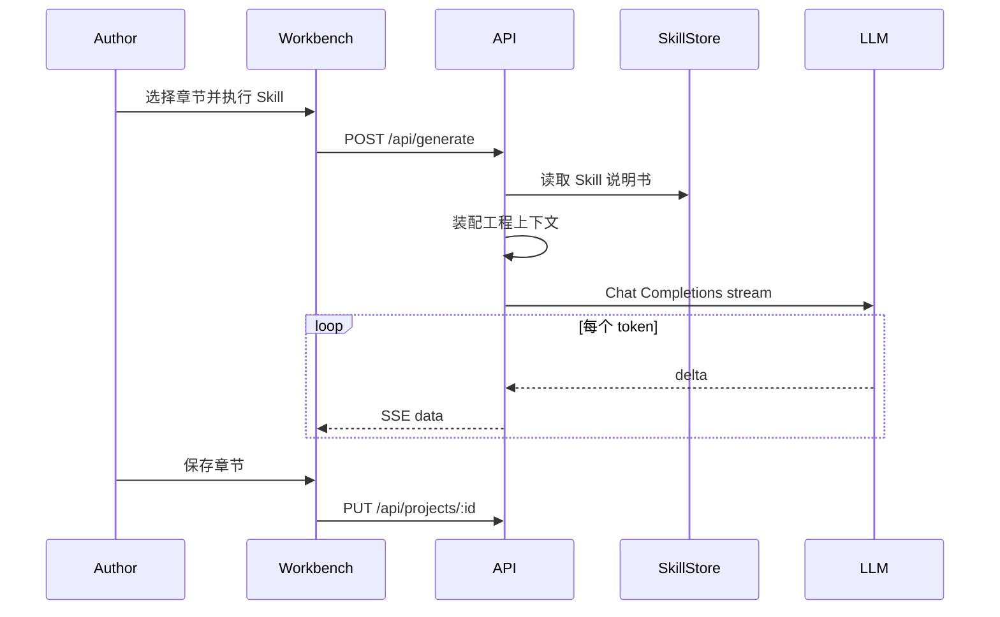

# 墨枢 AI 小说工坊

Feature Name: ai-novel-studio
Updated: 2026-09-03

## Description

墨枢是单作者 Web 写作工坊。作者以小说工程组织作品，按章节协作生成正文。系统用 Markdown Skill 说明书编排大模型：执行某个 Skill 时，后端读取说明书、装配当前工程上下文，再以流式方式把结果写回工作台。作者自备 OpenAI 兼容接口。

已确认决策：

- 生成节奏：逐章协作，支持停写、续写、润色、审稿
- Skill：9 个内置 Skill + 自定义 Skill 编辑
- 形态：单人 Web 工坊，数据落在工作区本地文件

## Architecture



请求路径：浏览器只访问前端端口。`/api` 由 Vite 反代到后端。Skill 执行走 `POST /api/generate`，响应为 `text/event-stream`。



## Components and Interfaces

### Frontend `frontend/`

- Vite 6 + React 18 + TypeScript
- 路由：`/` 工程列表，`/studio/:projectId` 三栏工作台，`/skills` Skill 管理，`/settings` 模型配置
- 工作台三栏：目录 / 稿纸编辑器 / Skill 面板与生成日志
- 视口宽度小于 768px 时改为标签切换的单栏布局
- `vite.config.ts` 配置 `server.proxy['/api']` 指向 `http://127.0.0.1:8787`，`server.allowedHosts` 包含 `.monkeycode-ai.online`

### Backend `backend/`

- Node.js + Express
- `GET/POST /api/projects` 工程列表与新建
- `GET/PUT/DELETE /api/projects/:id` 读取、保存、归档
- `GET/POST /api/skills` 列出内置与自定义 Skill，新建自定义 Skill
- `PUT /api/skills/:id` 更新自定义 Skill，支持停用
- `GET/PUT /api/settings` 读写 `USER_LLM_BASE_URL`、`USER_LLM_MODEL`、`USER_LLM_API_KEY`
- `POST /api/generate` 执行 Skill，SSE 推送 `token` / `done` / `error`
- `POST /api/settings/test` 用一条极短请求验证接口是否可用

### Skill 编排 `backend/src/services/skill-runner.js`

- 读取 Skill Markdown 全文作为系统指令
- 按 Skill 类型裁剪上下文：策划类只带元信息；正文类带世界观摘要、出场人物、本章细纲、上一章末 1200 字
- 将作者附加指令放在用户消息末尾
- 解析上游 SSE，转发给前端；作者点停止时中断上游请求

### 内置 Skill 文件 `skills/builtin/`

| ID | 文件 | 作用 |
|---|---|---|
| kickoff | `01-kickoff.md` | 开书策划 |
| world | `02-world.md` | 世界观构建 |
| characters | `03-characters.md` | 人物小传 |
| outline | `04-outline.md` | 全书大纲 |
| chapter-beats | `05-chapter-beats.md` | 分章细纲 |
| chapter-prose | `06-chapter-prose.md` | 章节正文 |
| continue | `07-continue.md` | 续写推进 |
| polish | `08-polish.md` | 文风润色 |
| review | `09-review.md` | 一致性审稿 |

每个 Skill 含 YAML front matter（`id`、`name`、`scene`、`target`）与正文说明书。

## Data Models

小说工程 JSON `data/novels/{id}.json`：

```json
{
  "id": "nv_xxx",
  "title": "书名",
  "logline": "一句话卖点",
  "genre": "玄幻",
  "status": "active",
  "updatedAt": "ISO-8601",
  "brief": { "pitch": "", "audience": "", "tone": "", "taboo": "" },
  "world": "",
  "characters": "",
  "outline": "",
  "chapters": [
    {
      "id": "ch_xxx",
      "index": 1,
      "title": "章名",
      "beats": "",
      "content": "",
      "wordCount": 0,
      "updatedAt": "ISO-8601"
    }
  ],
  "logs": [
    {
      "id": "log_xxx",
      "skillId": "chapter-prose",
      "chapterId": "ch_xxx",
      "startedAt": "ISO-8601",
      "endedAt": "ISO-8601",
      "status": "success",
      "outputChars": 0,
      "error": ""
    }
  ]
}
```

设置 `data/settings.json`：

```json
{
  "baseUrl": "",
  "model": "",
  "apiKey": ""
}
```

自定义 Skill `data/skills/{id}.md`，结构与内置 Skill 相同，另含 `enabled: true|false`。

## Correctness Properties

- 每个小说工程标识全局唯一，章节标识在工程内唯一
- 归档工程的 `status` 为 `archived`，列表默认只返回 `active`
- 执行 Skill 时系统指令必须包含完整 Skill 说明书
- 流式生成中途停止后，编辑器保留已到达的文本，等待作者决定是否保存
- 设置页对 API Key 只返回掩码，完整密钥仅存在 `data/settings.json`
- 代码读取的环境变量名为 `USER_LLM_API_KEY`、`USER_LLM_BASE_URL`、`USER_LLM_MODEL`，不读取平台内部密钥变量

## Error Handling

| 场景 | 处理 |
|---|---|
| 缺少 API Key / Base URL / Model | 返回 400，前端打开设置引导 |
| 上游 30 秒无首 token | 返回 SSE `error`，保留 Skill 参数 |
| 上游 4xx/5xx | 记录错误类型，编辑器内容保持不变 |
| 自定义 Skill 缺名称或正文 | 400，提示补全 |
| 工程不存在 | 404 |
| 生成中刷新页面 | 连接断开即停止上游，已保存数据不受影响 |

## Test Strategy

- 手工验收：新建工程、跑完策划到第一章正文、续写、润色、审稿、自定义 Skill、刷新后数据仍在
- 接口验收：无密钥时 `/api/generate` 返回引导错误；有密钥时 SSE 至少推送 `token` 与 `done`
- 回归：归档工程不出现在默认列表；停用的自定义 Skill 不出现在工作台

## References

[^1]: (Spec) - 需求文档 `.monkeycode/specs/ai-novel-studio/requirements.md`
