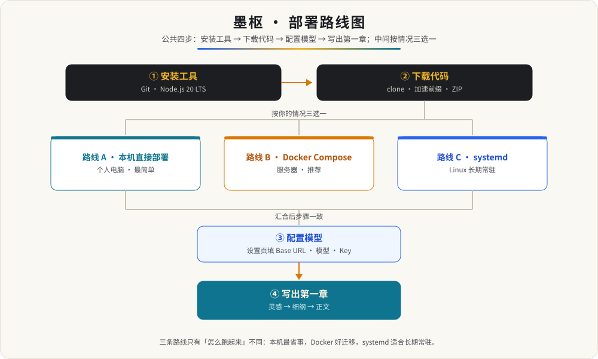

<h1 align="center">墨枢 · 部署指南（零基础版）</h1>

<p align="center">
  <strong>复制命令、按回车，Windows / macOS / Linux 都能跑起来</strong><br>
  墨枢是单人使用的 AI 小说工坊：后端在 <code>8787</code> 端口同时提供网页和接口，作品、文风、模型设置都以 JSON 存在 <code>data/</code> 目录。
</p>

<p align="center">
  
  
  
  
  
  
</p>

跟着本文做完，你会在浏览器里打开一个能直接写小说的页面。全程就是复制命令、按回车，不需要编程基础。

**本文导航**：[系统要求](#系统要求) · [🧭 先选路线](#-一先选一条路线) · [📦 准备知识](#-二准备先认识三样东西) · [🔧 安装工具](#-三安装必备工具) · [📥 下载代码](#-四下载代码所有路线第一步) · [💻 路线 A](#-五路线-a本机直接部署个人电脑推荐新手) · [🐳 路线 B](#-六路线-bdocker-compose服务器推荐) · [🔁 路线 C](#-七路线-csystemd-常驻linux-服务器) · [🔑 配置模型](#-八配置模型必须做否则无法生成) · [📝 写出第一章](#-九第一次使用写出第一章) · [🌐 公网访问](#-十局域网与公网访问) · [🧰 日常维护](#-十一日常维护) · [🧩 进阶](#-十二进阶) · [🔍 排错大全](#-十三排错大全)

## 系统要求

先确认机器满足下表，再往下走；缺什么就在第三节安装。

| 项目 | 要求 | 说明 |
| --- | --- | --- |
| 操作系统 | Windows 10+ / macOS 12+ / 主流 Linux | 三平台步骤本文都已覆盖 |
| Node.js | 20 LTS（最低 18） | 必须；运行后端与构建前端 |
| npm | 10.x（随 Node 安装） | 必须；安装依赖 |
| Git | 2.x | 必须；也可从 GitHub 下载 ZIP 代替 |
| Docker | 24+ 与 Compose 插件 | 仅路线 B / C 需要 |
| 磁盘 | 200 MB 以上 | 代码与依赖约 200 MB，作品数据另计且很小 |
| 网络 | 后端能出网 | 需要访问你在设置页配置的模型接口 |
| 模型接口 | 自备 API Key | 墨枢不内置模型，Key 只存本机 |

浏览器使用较新版本的 Chrome / Edge / Safari / Firefox 均可。

## 🧭 一、先选一条路线



公共步骤是**安装工具 → 下载代码 → 配置模型 → 写出第一章**，中间按你的情况三选一：

| 你的情况 | 推荐路线 | 难度 | 大概耗时 |
| --- | --- | --- | --- |
| 只在自己电脑上用 | 路线 A：本机直接部署 | 最简单 | 10 分钟 |
| 有服务器，想省心、方便迁移 | 路线 B：Docker Compose | 简单 | 15 分钟 |
| Linux 服务器要长期常驻 | 路线 C：systemd | 中等 | 20 分钟 |

> 💡 不确定就选路线 A。三条路线都要先完成第二、三、四步；想先在本机快速体验，也可以直接用 `bash scripts/setup.sh` 加 `bash scripts/serve.sh start` 两条命令完成路线 A。

## 📦 二、准备：先认识三样东西

- **终端**（又叫命令行、终端窗口）：一个可以输入命令的窗口。本文里带灰底的代码块，都是要你复制到终端里、按回车执行的。
- **Node.js**：运行墨枢的程序，必须安装。
- **Git**：用来把代码下载到本机、以后更新，必须安装。
- **Docker**：只有路线 B / C（服务器）才需要。

> 💡 命令执行后打印一大段文字是正常的，只要最后没有出现 `error` 字样即可继续。命令区分大小写，请原样复制。

## 🔧 三、安装必备工具

### 3.1 安装 Git

**Windows**

1. 打开 https://git-scm.com/download/win
2. 下载安装包，双击后一路点「下一步」

**macOS**

1. 打开「终端」，输入 `git --version`
2. 如果弹出安装提示，按提示点「安装」

**Linux（Ubuntu / Debian）**

```bash
sudo apt-get update
sudo apt-get install -y git
```

**三平台统一验证**

```bash
git --version
```

看到类似 `git version 2.x.x` 就成功了。

### 3.2 安装 Node.js 20 LTS

**Windows / macOS**

1. 打开 https://nodejs.org
2. 下载标注 LTS（20.x）的安装包，双击后一路「下一步」

**Linux（Ubuntu / Debian）**

```bash
curl -fsSL https://deb.nodesource.com/setup_20.x | sudo -E bash -
sudo apt-get install -y nodejs
```

**已经装过 Node 但版本偏低（例如 16）**，或者想在多个版本之间切换，推荐改用版本管理器。

<details>
<summary>用 nvm 管理 Node 版本（推荐）</summary>

macOS / Linux（nvm）：

```bash
curl -o- https://raw.githubusercontent.com/nvm-sh/nvm/v0.40.1/install.sh | bash
```

重开终端后执行：

```bash
nvm install 20
nvm use 20
nvm alias default 20
```

Windows（nvm-windows）：到 https://github.com/coreybutler/nvm-windows/releases 下载安装包，装完在 PowerShell 里执行：

```bash
nvm install 20
nvm use 20
```

</details>

**三平台统一验证**

```bash
node -v
npm -v
```

应分别显示 `v20.x.x` 和 `10.x.x` 左右。

> ⚠️ 版本低于 18 会在启动时提示引擎不匹配，请用上面的方法重新安装 20 LTS。

> 💡 国内网络建议切换 npm 镜像，安装依赖会快很多：`npm config set registry https://registry.npmmirror.com`

### 3.3 安装 Docker（只有路线 B / C 需要）

**Windows / macOS**

1. 打开 https://www.docker.com/products/docker-desktop
2. 下载 Docker Desktop，安装后启动它
3. 等右下角鲸鱼图标变绿

**Linux**

```bash
curl -fsSL https://get.docker.com | sudo sh
sudo usermod -aG docker $USER
```

> ⚠️ 执行完要注销并重新登录（或重启机器），当前用户才会进入 docker 组。

**验证**

```bash
docker --version
docker compose version
```

两条都能显示版本号即可。

### 3.4 学会进入项目目录

下载代码后会得到一个文件夹（例如 `AIxiaoshuo`）。本文后面所有命令都要在这个文件夹里执行。

- **Windows**：用文件管理器打开该文件夹，在顶部地址栏输入 `cmd` 回车，就会在当前目录打开终端
- **macOS**：在文件夹上点右键，选「服务」→「新建位于文件夹位置的终端窗口」
- **通用**：在终端里用 `cd 路径` 切换，例如 `cd ~/Downloads/AIxiaoshuo`

确认自己在不在正确目录：输入 `ls`（Windows 用 `dir`），能看到 `backend`、`frontend`、`skills`、`Dockerfile` 就是对的。

### 3.5 网络受限：镜像与代理

公司网络、校园网或国内直连较慢时，按下表配置一次，装依赖和下载镜像都会稳定很多。

| 场景 | 配置方法 |
| --- | --- |
| npm 下载慢或超时 | `npm config set registry https://registry.npmmirror.com` |
| npm 需要走代理 | `npm config set proxy http://代理地址:端口`，再执行 `npm config set https-proxy http://代理地址:端口` |
| Git 克隆 GitHub 慢或失败 | `git config --global http.proxy http://代理地址:端口`；不需要时用 `git config --global --unset http.proxy` 取消 |
| Docker Hub 拉不动 | 配置 `registry-mirrors`，或用第六节「不想拉取镜像」的办法 |
| 完全离线、装不了依赖 | 在同操作系统、同 Node 大版本的有网机器上执行 `npm ci`，再把 `frontend/node_modules`、`backend/node_modules` 和 `frontend/dist` 一起拷到目标机器 |

> 💡 代理地址若含用户名密码且带特殊字符，需要做 URL 编码，或直接改用内网镜像源。

## 📥 四、下载代码（所有路线第一步）

代码和 21 个内置 Skill 都在 Git 仓库里，先下载到本机。下面按顺序选一种能用的，任何一种成功即可继续。

### 方式 1：直接 git clone（推荐，之后能 git pull 升级）

```bash
git clone https://github.com/wansheng8/AIxiaoshuo.git
cd AIxiaoshuo
```

用自己的 Fork 就把地址换成你的仓库地址。

只想快速拿到最新代码、不关心提交历史，可以加 `--depth 1` 浅克隆（下载更小更快，同样支持 `git pull`）：

```bash
git clone --depth 1 https://github.com/wansheng8/AIxiaoshuo.git
```

### 方式 2：走 GitHub 加速前缀（国内直连慢或失败时）

在仓库地址前面加一个加速前缀再克隆。

> ⚠️ 加速站点由第三方维护、地址会不定期变动，下面的写法只是示例，使用前先搜索「GitHub 加速」找当前可用的站点，并自行确认可信度。

```bash
git clone https://ghfast.top/https://github.com/wansheng8/AIxiaoshuo.git
cd AIxiaoshuo
```

加速前缀只用于「下载」；以后 `git pull` 升级仍用原始地址。也可以一次性配置重定向，让 clone 和 pull 都走加速：

```bash
git config --global url."https://ghfast.top/https://github.com/".insteadOf "https://github.com/"
```

不需要时删除：

```bash
git config --global --unset url."https://ghfast.top/https://github.com/".insteadOf
```

### 方式 3：下载 ZIP（最稳，但没有 .git，之后不能 git pull）

1. 在 GitHub 仓库页面点绿色「Code」按钮
2. 选「Download ZIP」，解压后进入文件夹

> ⚠️ ZIP 方式升级 = 重新下载新 ZIP 覆盖旧文件，**务必保留原来的 `data/` 文件夹**（作品都在里面）。

### 拉库失败排查表

| 现象 | 原因 | 处理 |
| --- | --- | --- |
| clone 卡住 / 报 `unable to access` | 连不上 GitHub | 换方式 2 加速前缀，或方式 3 下 ZIP |
| clone 到一半中断 | 网络抖动 | 删除残留目录后重试 `rm -rf AIxiaoshuo`，或加 `--depth 1` |
| `git pull` 报 `not a git repository` | 当初是下载 ZIP 装的 | 用方式 1 / 2 重新 clone，再把 `data/` 拷回去；或继续用 ZIP 覆盖升级 |
| `git pull` 报 `local changes would be overwritten` | 改过被跟踪的文件（源码 / 文档） | 改动不要了：`git checkout -- .` 再 pull；想保留：`git stash` 再 pull。作品在 `data/`、配置在 `.env`，都被 `.gitignore` 忽略，不会被覆盖 |
| `git pull` 成功但页面还是旧版 | 只拉了代码没重建 | Docker：`docker compose up -d --build`；本机：`cd frontend && npm ci && npm run build` 后重启 |
| 有代理但 clone 仍慢 | 没给 Git 配代理 | 见 3.5 节 |

<details>
<summary>下载完成后，文件夹里应该有这些内容</summary>

```text
AIxiaoshuo/
├── backend/              后端代码（Express 单端口）
├── frontend/             网页源码（React + Vite）
├── skills/builtin/       21 个内置 Skill（不能删）
├── scripts/              setup.sh / serve.sh / check-model.js 等便捷脚本
├── docs/                 架构与路线示意图
├── deploy/               systemd 单元、nginx 示例、生产 env 示例
├── data/                 以后你的作品都在这里（首次启动自动创建）
├── Dockerfile
├── docker-compose.yml
├── start.sh              开发模式
├── start-prod.sh         生产模式
└── DEPLOYMENT.md
```

</details>

## 💻 五、路线 A：本机直接部署（个人电脑，推荐新手）

Windows 用户建议用「Git Bash」：安装 Git 时已自带，在项目文件夹里右键选「Open Git Bash here」即可。本文命令在 Git Bash、macOS、Linux 上完全通用。

### 第一步：一键安装（推荐）

在项目根目录执行：

```bash
bash scripts/setup.sh
```

它会检查 Node、生成 `.env`（如果还没有）、安装前后端依赖并构建前端。第一次会比较慢。

> 💡 如果提示找不到 lock 文件、`npm ci` 失败，就进入 `frontend` 或 `backend` 目录改用 `npm install`。安装时打印几条 `vulnerabilities`（漏洞）警告属正常，不影响使用。

<details>
<summary>不想用脚本、想手动执行</summary>

```bash
cd frontend
npm ci
npm run build

cd ../backend
npm ci --omit=dev
```

</details>

### 第二步：启动服务

```bash
bash scripts/serve.sh start
```

脚本会在后台启动并自动做健康检查，成功会打印访问地址。常用命令：

```bash
bash scripts/serve.sh status
bash scripts/serve.sh restart
bash scripts/serve.sh stop
```

想看运行日志：`tail -n 50 moshu.log`。

<details>
<summary>想在前台运行（关掉窗口即停止）</summary>

```bash
node backend/src/index.js
```

看到 `moshu backend on 8787` 就是启动成功。

</details>

> 💡 如果你用的是 PowerShell 或 CMD 而不是 Git Bash：脚本改用 `node backend/src/index.js` 前台运行即可，目录分隔符用反斜杠。

### 第三步：打开网页

浏览器访问：

```
http://127.0.0.1:8787
```

能看到墨枢首页即部署成功。

### 第四步：配置模型并自检

先在页面「设置」里填好 Base URL、模型名与 API Key，然后回到项目根目录执行：

```bash
node scripts/check-model.js
```

它会向模型接口的 `/models` 查询，确认你填的模型名真实存在。

> ⚠️ 若提示「不在列表」，按它列出的实际模型名修改设置页，不要凭名字猜。

### 第五步：安装完成自检清单

逐项确认，全部打勾就说明搭建成功：

- [ ] `node -v` 显示 `v20.x.x`
- [ ] 项目根目录存在 `.env`（可在文件管理器里勾选「显示隐藏文件」查看）
- [ ] 存在 `frontend/dist/index.html`
- [ ] `bash scripts/serve.sh status` 显示「运行中」
- [ ] 浏览器打开 http://127.0.0.1:8787 能看到首页
- [ ] 设置页填好模型后点「测试」返回成功
- [ ] `node scripts/check-model.js` 提示模型存在

> ⚠️ 任意一项不通过，先查第十三节「排错大全」。

### 第六步：开机自启（可选）

后台启动用 `bash scripts/serve.sh start` 已经够用。想让服务开机自动运行：Linux 服务器见「路线 C：systemd」，Windows / macOS 见「开机自启（Windows / macOS）」。

## 🐳 六、路线 B：Docker Compose（服务器推荐）

前提：已按 3.3 装好 Docker。

**第一步：准备代码。** 第一次部署用第四节的 `git clone`；已经克隆过的，更新代码用：

```bash
git pull
```

**第二步：准备数据目录。** Linux 必须执行 `chown`，macOS / Windows 的 Docker Desktop 可跳过：

```bash
mkdir -p data
sudo chown -R 1000:1000 data
```

**第三步：构建并启动。**

```bash
docker compose up -d --build
```

第一次会下载基础镜像并构建，需要几分钟。完成后浏览器访问：

```
http://服务器IP:8787
```

> 💡 想换端口：在项目根目录 `.env` 里设置 `PORT=9000`，再执行 `docker compose up -d --build`，之后访问 `http://服务器IP:9000`。`docker-compose.yml` 里的端口映射与容器内 `PORT` 都由这个变量控制，保持一致。

查看状态与日志：

```bash
docker compose ps
docker compose logs -f
```

`docker compose ps` 的 STATUS 显示 `healthy` 就是正常。

### 验证与排错（构建失败先看这里）

构建前先校验 compose 文件本身：

```bash
docker compose config
```

正常会打印展开后的完整配置；报错说明 compose 文件或 `.env` 里的变量有问题。

第一次 `docker compose up -d --build` 卡住或失败，按顺序定位：

1. 看是不是卡在「拉取 node:20-alpine」：国内拉 Docker Hub 慢，见下文「不想拉取镜像」；也可先手动 `docker pull node:20-alpine` 试速度。
2. 想看完整构建日志：改用前台构建 `docker compose up --build`（不加 `-d`），日志直接刷在终端，`Ctrl + C` 可中断；或单独执行 `docker compose build`。
3. 构建成功但容器反复重启：`docker compose logs moshu` 看运行日志；`docker compose ps` 的 STATUS 显示 `healthy` 才是正常，显示 `Restarting` 一般就是权限问题（见下）。

**Linux 服务器（尤其 CentOS / 云厂商镜像）两个高频权限坑**

- 目录属主不对：`sudo chown -R 1000:1000 data`（容器内以 UID 1000 的 `node` 用户运行）。
- 系统开了 SELinux（`getenforce` 返回 `Enforcing`）：光 `chown` 不够，挂载的 `data` 目录容器写不进去，日志报 `EACCES`。两种解法任选：
  - 改 `docker-compose.yml` 的卷挂载为 `- ./data:/app/data:Z`，然后 `docker compose up -d --build` 重建
  - 或执行 `sudo chcon -Rt container_file_t /绝对路径/data`

> 🔐 `:Z` 会关闭该卷的 SELinux 保护，仅建议在可信的私密服务器上使用。

**Windows / macOS（Docker Desktop）**

- 确认 Docker Desktop 已启动（右下角鲸鱼图标为绿色），否则 `docker compose` 会报「无法连接 Docker」。
- 挂载 C 盘一般无需设置；若提示找不到共享盘符，到 Docker Desktop → Settings → Resources → File Sharing 勾选对应盘符后重启 Docker。

### 停止与更新

```bash
docker compose down
docker compose up -d --build
```

更新后旧镜像可清理：

```bash
docker image prune -f
```

数据保存在宿主机的 `data/` 文件夹，删除容器不会丢数据。

<details>
<summary>不想拉取镜像（离线 / 内网）</summary>

镜像只需要基础镜像 `node:20-alpine`。只要本机已经有它，`docker compose build` 会直接复用，不会联网拉取；应用本身是从本仓库代码现构建的，不需要额外拉任何业务镜像。

如果本机没有、也不能访问 Docker Hub，可任选一种：

**有内网镜像仓库时**，把基础镜像换成仓库地址再构建：

```bash
NODE_IMAGE=registry.example.com/library/node:20-alpine docker compose up -d --build
```

**完全离线时**，先在有网的机器上导出，再拷到目标机器导入：

```bash
# 有网的机器
docker pull node:20-alpine
docker save node:20-alpine -o node20-alpine.tar

# 目标机器（导入后基础镜像即存在，构建不再联网）
docker load -i node20-alpine.tar
docker compose up -d --build
```

**只配置国内镜像加速器**（Docker Hub 慢但仍可达时）见 Docker Desktop「Settings → Docker Engine」，或 Linux 的 `/etc/docker/daemon.json` 中的 `registry-mirrors`。

</details>

## 🔁 七、路线 C：systemd 常驻（Linux 服务器）

适合让服务长期后台运行、开机自动拉起，不依赖 Docker。

**第一步：部署代码并安装依赖。** 把代码放到 `/opt/moshu`，然后按路线 A 完成前端构建与后端依赖安装：

```bash
sudo mkdir -p /opt/moshu
sudo chown -R $USER:$USER /opt/moshu
git clone https://github.com/wansheng8/AIxiaoshuo.git /opt/moshu
cd /opt/moshu
bash scripts/setup.sh
```

**第二步：创建专用用户，准备数据目录与环境变量文件。**

```bash
sudo useradd -r -s /usr/sbin/nologin moshu
sudo mkdir -p /opt/moshu/data
sudo chown -R moshu:moshu /opt/moshu/data
sudo cp /opt/moshu/deploy/moshu.env.example /opt/moshu/deploy/moshu.env
```

**第三步：安装并启动服务。**

```bash
sudo cp /opt/moshu/deploy/moshu.service /etc/systemd/system/moshu.service
sudo systemctl daemon-reload
sudo systemctl enable --now moshu
```

**第四步：查看状态与日志。**

```bash
systemctl status moshu
journalctl -u moshu -f
```

> 💡 改端口、密码等配置改 `/opt/moshu/deploy/moshu.env` 后执行 `sudo systemctl restart moshu` 生效。

> ⚠️ 用 systemd 部署时，`data/` 目录属主必须是 `moshu`，否则写入会失败。

## 🔑 八、配置模型（必须做，否则无法生成）

墨枢本身不提供模型，需要你自备一个模型接口（API Key）。

### 8.1 获取 API Key（以 DeepSeek 为例）

1. 打开 https://platform.deepseek.com
2. 注册并登录，进入「API Keys」页面
3. 点创建，复制生成的 Key 并保存好（只显示一次）

不想用 DeepSeek 也可以，见 8.3 的常见供应商表。

### 8.2 在页面里填写

1. 打开墨枢，点左侧导航「设置」
2. 协议选「OpenAI Chat 兼容」
3. 选择供应商预设，或手动填 Base URL、模型名、API Key
4. 点「测试」，提示成功说明连上了
5. 点「拉取模型」可从列表里挑，也可以手动输入模型名
6. 保存。需要多个供应商时，保存后在顶部切换

### 8.3 常见供应商参数

| 供应商 | 协议 | Base URL | 模型示例 |
| --- | --- | --- | --- |
| DeepSeek | openai-chat | https://api.deepseek.com/v1 | deepseek-chat |
| 通义千问 | openai-chat | https://dashscope.aliyuncs.com/compatible-mode/v1 | qwen-plus |
| 智谱 GLM | openai-chat | https://open.bigmodel.cn/api/paas/v4 | glm-4-flash |
| Kimi | openai-chat | https://api.moonshot.cn/v1 | moonshot-v1-auto |
| 硅基流动 | openai-chat | https://api.siliconflow.cn/v1 | 见官网 |
| OpenAI | openai-chat | https://api.openai.com/v1 | gpt-4o-mini |
| Anthropic | anthropic | https://api.anthropic.com/v1 | claude-sonnet-4-5 |
| Gemini | gemini | https://generativelanguage.googleapis.com/v1beta | gemini-2.0-flash |
| Ollama（本地） | ollama | http://127.0.0.1:11434 | 见 `ollama list` |

> 🔐 Key 只保存在本机 `data/settings.json`，不要写进脚本，也不要提交到仓库。

## 📝 九、第一次使用：写出第一章

1. 首页点「新建作品」，写一句灵感，例如：末世废土里，主角靠捡垃圾觉醒
2. 打开这本书，在「稿本」里依次执行：开书策划、设定手册、全书大纲、人物资产
3. 生成「分章细纲」，再点「按细纲拆入目录」，就得到章节目录
4. 打开第一章，点「本章正文」生成；写不动时点「续写」；定稿前用「审稿」
5. 想贴合个人笔感：进「文风」页，导入你写过的 500 字以上原文

> 💡 所有修改都会自动保存，关掉浏览器不会丢。

## 🌐 十、局域网与公网访问

- **同一局域网**（手机、另一台电脑）：用 `http://这台电脑的内网IP:8787` 访问。Windows / macOS 首次会弹防火墙提示，选择「允许」。
- **云服务器**：在云厂商控制台的「安全组」或系统防火墙里放行 8787 端口。
- **想用域名并启用 HTTPS**：见第十二节「反向代理与 HTTPS」。

### 🔐 设置访问密码（公网强烈建议）

默认没有密码，谁打开链接谁就能看到你的稿子。公网部署时请在项目根目录的 `.env` 里加一行，然后重启服务：

```bash
ACCESS_PASSWORD=你的访问密码
```

设置后，打开网页会先要求输入密码，验证通过才进入；除 `/api/health`（供健康检查）外的所有接口都需要验证。密码留空或删掉这一行，就恢复成不需要密码。修改密码后旧登录会自动失效，需要重新输入。

Docker Compose 部署时，同样在项目根目录的 `.env` 里设置 `ACCESS_PASSWORD`，然后 `docker compose up -d` 重建容器即可。

## 🧰 十一、日常维护

### 备份

所有数据都在 `data/`，备份就是打包这个目录：

```bash
tar -czf moshu-backup-$(date +%Y%m%d).tar.gz data/
```

Windows 直接复制整个 `data` 文件夹即可。恢复时先停止服务，把备份解回 `data/`，再启动。

### 换一台机器 / 迁移数据

1. 在旧机器停止服务，按上一节打包 `data/`
2. 在新机器按本文装好 Node 与依赖，并克隆代码
3. 把解压后的 `data/` 放到新机器的项目根目录（覆盖同名目录）
4. 启动服务，打开首页确认作品、文风、模型设置都在

Docker 部署同理：把 `data/` 放到宿主机项目目录，再 `docker compose up -d`。

> 🔐 模型 Key 存在 `data/settings.json`，会随 `data/` 一起迁移，无需重新填写。

### 升级

已经用 `git clone` 下载的：

```bash
git pull
```

> ⚠️ 用 ZIP 方式安装的用户没有 `.git`，无法 `git pull`，请重新下载新 ZIP 覆盖旧文件，**务必保留原来的 `data/` 文件夹**（作品都在里面）。

**Docker Compose**

```bash
docker compose up -d --build
```

**本机直接部署**

```bash
cd frontend
npm ci
npm run build

cd ../backend
npm ci --omit=dev
```

然后重启服务：本机是 `Ctrl + C` 后重新 `node backend/src/index.js`，systemd 是 `sudo systemctl restart moshu`。

> 💡 旧工程的 JSON 里带 `schemaVersion`，首次打开会自动迁移并留快照，无需手工处理。

### 回滚

切回旧版本代码并重新构建即可。数据向后兼容，回滚前建议先备份 `data/`。

### 卸载与重置

- **只清空作品**：停止服务，先备份 `data/`，再删除其中的 `novels/`、`teardowns/` 等目录，重启即可；保留 `data/settings.json` 则模型配置还在
- **恢复出厂**：停止服务，删除整个 `data/` 目录，重启时会重新创建，作品与模型设置一并清空
- **完全卸载**：停止服务后删除整个项目文件夹即可；Docker 版再执行 `docker compose down`，并按需删除镜像 `docker rmi moshu:latest`

> ⚠️ 删除前务必备份，`data/` 删掉后无法找回。

### 健康检查

```bash
curl http://127.0.0.1:8787/api/health
```

返回 `{"ok":true,"name":"moshu"}` 即正常。Docker 内置了健康检查，`docker compose ps` 会显示 `healthy`。

## 🧩 十二、进阶

### 环境变量

| 变量 | 默认值 | 说明 |
| --- | --- | --- |
| `PORT` | `8787` | 服务端口 |
| `PROMPT_TOKEN_BUDGET` | `40000` | 提示词 token 预算，超出后按优先级裁剪 |
| `LLM_RETRY_ATTEMPTS` | `3` | 生成失败重试次数（1-8） |
| `LLM_RETRY_BASE_MS` | `800` | 重试退避基数毫秒 |
| `LLM_RETRY_MAX_MS` | `15000` | 重试退避上限毫秒 |
| `ACCESS_PASSWORD` | 空 | 可选访问密码；留空表示不启用鉴权，公网部署建议设置 |

两种设置方式任选：

- 把仓库根目录的 `.env.example` 复制成同目录的 `.env`，改里面的值，重启服务即可。`.env` 会被后端自动读取，已经存在的同名环境变量优先、不会被覆盖。
- 在启动命令前临时指定，例如改端口：

```bash
PORT=9000 node backend/src/index.js
```

模型接口（Base URL、模型名、API Key）在应用「设置」页填写，不走环境变量。用 systemd 部署时，改 `deploy/moshu.env` 即可。

### 反向代理与 HTTPS

后端已同时提供页面与接口，前面接一个 nginx 就能绑定域名。把 `deploy/nginx.conf` 复制到 nginx 配置目录，并把里面的 `server_name` 换成你的域名：

```bash
sudo cp deploy/nginx.conf /etc/nginx/conf.d/moshu.conf
sudo nginx -t
sudo systemctl reload nginx
```

签发 HTTPS 证书（以 certbot 为例）：

```bash
sudo certbot --nginx -d moshu.example.com
```

> ⚠️ 生成接口是 SSE 流式响应，nginx 必须关闭 `proxy_buffering` 并放宽超时，`deploy/nginx.conf` 已经写好。

### 开机自启（Windows / macOS）

Linux 用路线 C 的 systemd。Windows 与 macOS 分别用任务计划程序和 launchd，效果都是登录后自动执行 `serve.sh start`。

**Windows（任务计划程序）**

1. 先确认在 Git Bash 里执行 `bash scripts/serve.sh start` 能正常启动
2. 在 Git Bash 执行 `where bash`，记下路径（通常是 `C:\Program Files\Git\bin\bash.exe`）
3. 按 `Win + R`，输入 `taskschd.msc` 回车，打开「任务计划程序」
4. 右侧点「创建任务」，名称填 `墨枢`；「常规」里勾选「不管用户是否登录都要运行」
5. 「触发器」新建一条：开始任务选「启动时」或「登录时」
6. 「操作」新建一条：程序或脚本填第 2 步记下的 `bash.exe` 路径，添加参数填 `-lc "/d/你的路径/AIxiaoshuo/scripts/serve.sh start"`（盘符 `D:` 在 Git Bash 里写作 `/d/`）
7. 保存

**macOS（launchd）**

新建 `~/Library/LaunchAgents/com.moshu.serve.plist`，把里面的用户名和路径换成你的：

```xml
<?xml version="1.0" encoding="UTF-8"?>
<!DOCTYPE plist PUBLIC "-//Apple//DTD PLIST 1.0//EN" "http://www.apple.com/DTDs/PropertyList-1.0.dtd">
<plist version="1.0">
<dict>
  <key>Label</key>
  <string>com.moshu.serve</string>
  <key>ProgramArguments</key>
  <array>
    <string>/bin/bash</string>
    <string>/Users/你的用户名/AIxiaoshuo/scripts/serve.sh</string>
    <string>start</string>
  </array>
  <key>WorkingDirectory</key>
  <string>/Users/你的用户名/AIxiaoshuo</string>
  <key>RunAtLoad</key>
  <true/>
</dict>
</plist>
```

加载并立即生效：

```bash
launchctl load ~/Library/LaunchAgents/com.moshu.serve.plist
```

> 💡 launchd 的环境变量很干净，如果 `node` 是用 nvm 安装的（不在 `/usr/local/bin`），可能提示找不到 `node`。在终端执行 `which node` 拿到绝对路径后，把 `serve.sh` 里的 `node` 换成该路径即可；也可在 plist 里加一段 `EnvironmentVariables` 指定 `PATH`。

两种方式都只负责「开机拉起」；日常仍可用 `scripts/serve.sh stop` / `restart` 管理。如果启动失败，先看 `moshu.log`。

### Docker 单容器（不用 Compose）

构建镜像（需要指定本地或内网基础镜像时加 `--build-arg NODE_IMAGE=镜像地址`）：

```bash
docker build -t moshu:latest .
```

运行：

```bash
docker run -d \
  --name moshu \
  --restart unless-stopped \
  -p 8787:8787 \
  -e PORT=8787 \
  -v "$(pwd)/data:/app/data" \
  moshu:latest
```

Windows PowerShell 里 `$(pwd)` 不可用，改用下面写法（Git Bash / Linux / macOS 用上面的命令即可）：

```powershell
docker run -d `
  --name moshu `
  --restart unless-stopped `
  -p 8787:8787 `
  -e PORT=8787 `
  -v "${PWD}/data:/app/data" `
  moshu:latest
```

查看日志与清理：

```bash
docker logs -f moshu

docker stop moshu
docker rm moshu
docker rmi moshu:latest
```

> 💡 `-e PORT=9000` 与 `-p 9000:9000` 要成对修改；删镜像后下次启动需重新构建。

## 🔍 十三、排错大全

按你看到的现象查：

| 现象 | 原因与解决 |
| --- | --- |
| 浏览器打不开页面 | 服务没启动。确认运行窗口里有 `moshu backend on 8787`；再换浏览器或清缓存试试 |
| 页面白屏 / 控制台报 404 | 前端没构建。执行 `cd frontend && npm ci && npm run build` |
| `npm ci` 报错 | 多半是网络问题，先 `npm config set registry https://registry.npmmirror.com`，或改用 `npm install` |
| 提示端口被占用 | 换端口启动：`PORT=9000 node backend/src/index.js`，然后访问 9000 |
| 设置页「测试」失败 | 检查 Base URL 结尾版本号是否正确、Key 是否复制完整、账户余额是否充足 |
| 提示模型不存在 / 返回空白 | 执行 `node scripts/check-model.js`，按它列出的实际模型名修改设置页，别凭名字猜 |
| 模型报鉴权失败 | 到设置页重填 Key 再测试；鉴权类错误不会自动重试 |
| 生成很久没反应 | 大模型本身较慢属正常；经 nginx 时确认已关闭缓冲（见 `deploy/nginx.conf`） |
| Docker 容器反复重启 / 写不进去 | 先 `docker compose logs moshu` 看日志；Linux 执行 `sudo chown -R 1000:1000 data`；CentOS / 云镜像再查 SELinux（见第六节「验证与排错」） |
| `docker compose up` 卡在拉取 node:20-alpine | Docker Hub 慢。见 3.5 与第六节「不想拉取镜像」，或先用内网镜像仓库 |
| `docker compose` 报连不上 Docker | Windows / macOS 先启动 Docker Desktop；Linux 确认当前用户已加入 docker 组（见 3.3） |
| 改了 `.env` 的 `PORT` 但页面还是 8787 | Compose 版改完要重建：`docker compose up -d --build`；单容器版用 `-e PORT=9000 -p 9000:9000`，两处端口必须一致 |
| 「资产」页没有内置 Skill | 部署时漏了 `skills/builtin`。重新完整克隆仓库；后端启动日志会打印缺失告警 |
| 数据会随容器删除丢吗 | 不会，`data/` 已挂载到宿主机 |
| 打开网页要求输入密码 | 已设置 `ACCESS_PASSWORD`。输入你在 `.env` 里填的密码；忘记就删掉该行并重启 |
| `node -v` 低于 18 或提示引擎不匹配 | 用 nvm / nvm-windows 安装 20 LTS：`nvm install 20 && nvm use 20`（见 3.2） |
| `git clone` 卡住或失败 | 配置 Git 代理，或改在 GitHub 页面下载 ZIP（见 3.5、第四节） |
| `npm ci` 一直卡住 | 切换到 npmmirror 镜像；公司网络再配 npm 代理（见 3.5） |
| 开机后服务没自动起来 | 看 `moshu.log`；确认任务计划程序 / launchd 里的项目路径与 `bash` 路径正确 |

## 🏁 到这一步就完成了

部署完成后，回到 README 的「建议写法」，按开书策划 → 世界观 → 人物小传 → 全书大纲 → 分章细纲 → 逐章正文的顺序走一遍，就能写出第一章。

遇到本文没覆盖的问题，欢迎到 [Issues](https://github.com/wansheng8/AIxiaoshuo/issues) 反馈；更多说明见 [README.md](./README.md) 与 [USER_GUIDE.md](./USER_GUIDE.md)。
