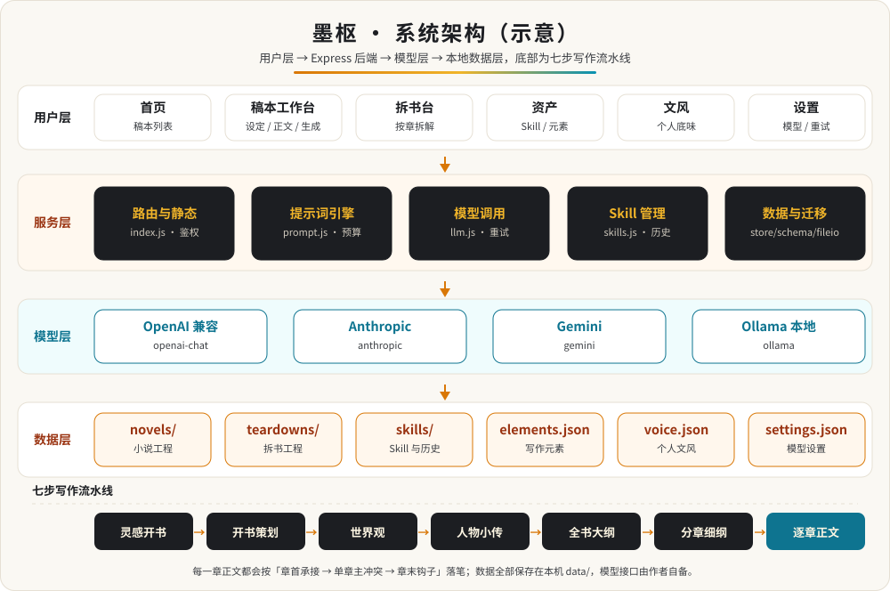

<h1 align="center">墨枢</h1>

<p align="center">
  <strong>单人 AI 小说工坊</strong><br>
  作者按章写作，系统用 Markdown Skill 说明书编排大模型，完成开书策划、世界观、人物、大纲、分章细纲、正文、续写、润色、审稿与拆书。<br>
  数据全部落在本机 <code>data/</code>，模型接口由作者自备。
</p>

<p align="center">
  
  
  
  
  
  
  
  
</p>

**文档导航**：[核心能力](#核心能力) · [页面速览](#页面速览) · [快速开始](#快速开始) · [配置模型](#配置模型) · [使用方法](#使用方法) · [部署方式](#部署方式) · [环境变量](#环境变量) · [系统架构](#系统架构) · [项目结构](#项目结构) · [数据位置](#数据位置) · [文档索引](#文档索引) · [反馈](#反馈)

## 核心能力

| 能力 | 能力 |
| --- | --- |
| **21 个内置 Skill**<br>12 个写作类 + 9 个拆书类，可在「资产」页阅读全文、克隆、微调 | **自定义 Skill**<br>自己写说明书，指定写入立项 / 世界 / 人物 / 大纲 / 细纲 / 正文 |
| **Skill 四层结构**<br>运行时基线、条件注入、Markdown 单份导入导出、历史行级 diff 与回退 | **提示词组装引擎**<br>`buildPrompt()` 统一拼装，token 预算与超预算优先级裁剪，保存前可预览 |
| **模型错误重试**<br>仅对 429 / 5xx / 网络错误在首包前指数退避，可配重试次数与退避上限 | **个人文风（底味）**<br>导入作者原文样本，逆向出个人文风说明书，压过平台通用家规 |
| **拆书工作台**<br>导入自备 TXT / Markdown，按章拆章纲、角色、黄金三章、事件、大纲、细纲、技法、仿写骨架 | **章节审稿**<br>按番茄标尺给出钩子、爽点密度、人设反差、合规与可执行改稿建议 |
| **三栏工作台**<br>目录与设定、稿纸、手艺面板；流式生成，随时停笔 | **数据加固**<br>schema 版本与迁移、原子写与备份、乐观锁并发写保护 |

## 页面速览

| 路径 | 页面 | 说明 |
| --- | --- | --- |
| `/` | 首页 | 稿本列表、新建 / 导入 / 灵感开书 |
| `/studio/:id` | 稿本工作台 | 设定、细纲、逐章正文与生成 |
| `/teardown` | 拆书 | 拆书工程列表与导入 |
| `/teardown/:id` | 拆书工作台 | 按章节切片做技法拆解 |
| `/skills` | 资产 | Skill 阅读、编辑、导入导出、历史回退、元素与提示词预览 |
| `/voice` | 文风 | 个人文风样本、说明书生成、迭代与试笔 |
| `/settings` | 设置 | 模型供应商、重试参数 |

## 快速开始

三条命令即可在本机跑起来；需要逐步照做时看 [DEPLOYMENT.md](./DEPLOYMENT.md)（零基础版）。

```bash
# 1. 下载代码与 21 个内置 Skill
git clone https://github.com/wansheng8/AIxiaoshuo.git
cd AIxiaoshuo

# 2. 检查环境、安装依赖、构建前端
bash scripts/setup.sh

# 3. 后台启动服务
bash scripts/serve.sh start
```

浏览器打开 `http://127.0.0.1:8787`，进入「设置」页填好模型接口，即可开始写作。

> 国内直连 GitHub 慢或 `git clone` 失败：可用浅克隆 `git clone --depth 1 ...`、加速前缀，或直接下载 ZIP；三种方式与「拉库失败排查表」见 [DEPLOYMENT.md 的「下载代码」](./DEPLOYMENT.md#-四下载代码所有路线第一步)。

<details>
<summary>运行环境要求</summary>

| 项目 | 要求 | 说明 |
| --- | --- | --- |
| Node.js | 20 LTS（最低 18） | 运行后端、构建前端；[nodejs.org](https://nodejs.org) |
| npm | 10.x（随 Node 安装） | 安装依赖 |
| Git | 2.x | 下载与更新代码；也可在 GitHub 页面下载 ZIP 代替 |
| Docker | 24+ 与 Compose 插件 | 仅容器方式需要；[docker.com](https://www.docker.com/products/docker-desktop) |
| 磁盘 | 200 MB 以上 | 代码与依赖约 200 MB，作品数据体积很小 |
| 网络 | 后端能出网 | 需访问你在设置页配置的模型接口 |
| 模型接口 | 自备 API Key | 墨枢不内置模型，Key 只存本机 |

浏览器使用较新版本的 Chrome / Edge / Safari / Firefox 均可。

</details>

## 配置模型

打开「设置」页，填写协议、Base URL、模型名与 API Key 即可。支持 OpenAI 兼容 Chat Completions、Anthropic、Ollama、Gemini 四类协议，可保存多个供应商并切换。

| 供应商 | 协议 | Base URL | 模型示例 |
| --- | --- | --- | --- |
| DeepSeek | openai-chat | https://api.deepseek.com/v1 | deepseek-chat |
| 通义千问 | openai-chat | https://dashscope.aliyuncs.com/compatible-mode/v1 | qwen-plus |
| 智谱 GLM | openai-chat | https://open.bigmodel.cn/api/paas/v4 | glm-4-flash |
| Kimi | openai-chat | https://api.moonshot.cn/v1 | moonshot-v1-auto |
| 硅基流动 | openai-chat | https://api.siliconflow.cn/v1 | 见官网 |
| OpenAI | openai-chat | https://api.openai.com/v1 | gpt-4o-mini |
| Anthropic | anthropic | https://api.anthropic.com/v1 | claude-sonnet-4-5 |
| Gemini | gemini | https://generativelanguage.googleapis.com/v1beta | gemini-2.0-flash |
| Ollama（本地） | ollama | http://127.0.0.1:11434 | 见 `ollama list` |

配置完成后建议核对模型名是否真实可用（避免凭名字猜）：

```bash
node scripts/check-model.js
```

Key 只保存在本机 `data/settings.json`，不要写进脚本，也不要提交到仓库。各供应商的注册与参数细节见 [DEPLOYMENT.md 的「配置模型」](./DEPLOYMENT.md#-八配置模型必须做否则无法生成)。

## 使用方法

墨枢的操作都在网页里完成，没有命令行子命令；服务本身用脚本启停。

**启停与自检**

| 命令 | 作用 |
| --- | --- |
| `bash scripts/setup.sh` | 检查 Node、生成 `.env`、安装依赖并构建前端 |
| `bash scripts/serve.sh start` | 后台启动，启动后自动做健康检查 |
| `bash scripts/serve.sh status` | 查看运行状态与访问地址 |
| `bash scripts/serve.sh restart` | 重启服务 |
| `bash scripts/serve.sh stop` | 停止服务 |
| `node scripts/check-model.js` | 核对设置页里的模型名是否真实可用 |

**界面操作**

| 想做什么 | 去哪里 | 说明 |
| --- | --- | --- |
| 新建、导入或灵感开书 | 首页 | 写一句灵感即可开一部新书 |
| 开书策划、世界观、人物、全书大纲、分章细纲 | 稿本工作台 | 按顺序执行，产物自动存入工程 |
| 把细纲拆成章节目录 | 稿本工作台 | 点「按细纲拆入目录」 |
| 逐章生成正文、续写、润色 | 稿本工作台 | 打开章节点对应按钮，流式生成，可随时停笔 |
| 章节审稿 | 稿本工作台 | 按番茄标尺给出钩子、爽点、合规与改稿建议 |
| 拆解参考小说 | 拆书页 | 导入自备 TXT / Markdown，默认只拆前 30 章 |
| 让代笔贴近个人笔感 | 文风页 | 导入 500 字以上原文，生成个人文风说明书 |
| 阅读、克隆、编辑内置与自定义 Skill | 资产页 | 支持导入导出与历史回退 |
| 切换模型供应商、调重试参数 | 设置页 | 协议、Base URL、模型名与 API Key |
| 设置访问密码 | `.env` | 见「环境变量」 |

逐页的详细说明见 [USER_GUIDE.md](./USER_GUIDE.md)。

## 部署方式

墨枢生产模式为单端口：后端在 `8787` 同时提供页面与 API，数据落在 `data/`。按场景选一种即可，完整步骤见 [DEPLOYMENT.md](./DEPLOYMENT.md)。

| 方式 | 适用场景 | 访问地址 |
| --- | --- | --- |
| 方式零 · 预构建镜像 | 只装 Docker，最快开始 | `http://服务器IP:8787` |
| 方式一 · 本机开发模式 | 本地开发调试 | `http://127.0.0.1:5173` |
| 方式一 · 本机生产模式 | 个人电脑长期使用 | `http://127.0.0.1:8787` |
| 方式二 · Docker Compose | 服务器部署（推荐） | `http://服务器IP:8787` |
| 方式三 · Docker 单容器 | 不想用 Compose | `http://服务器IP:8787` |
| 方式四 · systemd | Linux 服务器常驻 | `http://服务器IP:8787` |

**方式零 · 预构建镜像**（不用装 Git / Node，也不用克隆代码）

```bash
docker run -d --name moshu --restart unless-stopped \
  -p 8787:8787 -e PORT=8787 \
  -v "$(pwd)/data:/app/data" \
  ghcr.io/wansheng8/moshu:latest
```

Windows PowerShell 把 `"$(pwd)/data"` 换成 `"${PWD}/data"`。每次仓库更新，GitHub Actions 会自动构建并推送镜像；升级用 `docker pull ghcr.io/wansheng8/moshu:latest` 后重建容器。

**方式一 · 本机生产模式**

```bash
cd frontend && npm ci && npm run build
cd ../backend && npm ci --omit=dev
cd .. && bash scripts/serve.sh start
```

**方式二 · Docker Compose**

```bash
mkdir -p data && sudo chown -R 1000:1000 data
docker compose up -d --build
```

想换端口：在项目根目录 `.env` 里设置 `PORT=9000`，再执行 `docker compose up -d --build`。容器以非 root 的 `node` 用户运行，Linux 首次部署需把宿主 `data/` 归属改为 `1000:1000`。

方式三（Docker 单容器，见 [进阶](./DEPLOYMENT.md#-十二进阶)）、方式四（systemd 常驻，见 [路线 C](./DEPLOYMENT.md#-七路线-csystemd-常驻linux-服务器)）、离线 / 内网构建、反向代理与 HTTPS 等，见 [DEPLOYMENT.md](./DEPLOYMENT.md)。

## 环境变量

| 变量 | 默认值 | 说明 |
| --- | --- | --- |
| `PORT` | `8787` | 服务端口 |
| `PROMPT_TOKEN_BUDGET` | `40000` | 提示词 token 预算 |
| `LLM_RETRY_ATTEMPTS` | `3` | 生成失败重试次数（1-8） |
| `LLM_RETRY_BASE_MS` | `800` | 退避基数毫秒 |
| `LLM_RETRY_MAX_MS` | `15000` | 退避上限毫秒 |
| `ACCESS_PASSWORD` | 空 | 可选访问密码；留空表示不启用鉴权，公网部署建议设置 |

在项目根目录 `.env` 里设置即可，后端启动时自动读取（已存在的同名环境变量优先）。模型接口（Base URL、模型名、API Key）在应用「设置」页填写，保存在 `data/settings.json`，不通过环境变量注入。

## 系统架构



- **用户层**：首页、稿本工作台、拆书台、资产、文风、设置六个页面，全部通过 `/api` 与后端交互。
- **服务层**：Express 单端口同时提供 API 与页面，核心五块为路由与静态 `index.js`、提示词引擎 `prompt.js`、模型调用 `llm.js`、Skill 管理 `skills.js`、数据与迁移 `store.js` / `schema.js` / `fileio.js`。
- **模型层**：四类协议适配你自备的接口，OpenAI 兼容（DeepSeek / 千问 / GLM / Kimi / 硅基流动 / OpenAI）、Anthropic、Gemini、Ollama。
- **数据层**：作品、拆书、Skill、元素、文风、模型设置全部保存在本机 `data/`。
- **写作流水线**：灵感开书 → 开书策划 → 世界观 → 人物小传 → 全书大纲 → 分章细纲 → 逐章正文；生成结果经 `applyGenerated()` 写回工程，再经乐观锁落盘。

## 项目结构

<details>
<summary>展开目录树</summary>

```text
AIxiaoshuo/
├── backend/              后端（Express 单端口，同时提供 API 与页面）
│   └── src/
│       ├── index.js      入口：路由、静态托管、可选访问密码
│       ├── prompt.js     提示词组装引擎
│       ├── llm.js        模型调用、流式输出与重试
│       ├── providers.js  供应商协议目录
│       ├── store.js      数据读写、迁移与乐观锁
│       ├── schema.js     版本与迁移链
│       ├── fileio.js     原子写与备份
│       └── skills.js     内置与自定义 Skill 管理
├── frontend/             前端（React + Vite）
│   └── src/
│       ├── pages/        首页 / 稿本 / 拆书 / 资产 / 文风 / 设置
│       ├── api.ts        接口封装
│       └── app-state.tsx 全局状态
├── skills/
│   └── builtin/          21 个内置 Skill（12 写作 + 9 拆书，勿删）
├── scripts/
│   ├── setup.sh          一键安装依赖并构建前端
│   ├── serve.sh          后台启动 / 停止 / 重启 / 状态
│   └── check-model.js    核对模型名是否真实可用
├── docs/                 架构示意图
├── deploy/               systemd 单元、nginx 示例、生产 env 示例
├── data/                 作品、文风、设置（首次启动自动创建）
├── Dockerfile            多阶段镜像构建
├── docker-compose.yml    Compose 部署
├── start.sh              开发模式（Vite 热更新）
├── start-prod.sh         生产模式（单端口直连）
├── DEPLOYMENT.md         零基础部署指南
├── USER_GUIDE.md         使用说明
├── DEVELOPMENT.md        开发与架构
└── CHANGELOG.md          变更记录
```

</details>

## 数据位置

<details>
<summary>展开 data/ 目录说明</summary>

```text
data/
├── novels/            小说工程（每部一个 JSON）
├── teardowns/         拆书工程
├── skills/            自定义 Skill 与覆盖层
├── skill-history/     Skill 历史快照
├── backups/           原子写备份
├── conflicts/         并发写冲突副本
├── elements.json      写作元素
├── voice.json         个人文风
└── settings.json      模型设置
```

备份即打包该目录：`tar -czf moshu-backup-$(date +%Y%m%d).tar.gz data/`。恢复时先停止服务，把备份解回 `data/` 再启动。

</details>

## 建议写法

1. 新开一部，写一句灵感
2. 依次执行：开书策划 → 世界观 → 人物小传 → 全书大纲 → 分章细纲
3. 点「按细纲拆入目录」，得到章节目录
4. 逐章执行「章节正文」，卡住时用续写，定稿前用审稿
5. 在「文风」页导入自己的原文，让代笔贴近个人笔感

## 文档索引

- [DEPLOYMENT.md](./DEPLOYMENT.md)：零基础部署指南（下载代码 / 本机 / Docker / systemd / 反向代理 / 排错）
- [USER_GUIDE.md](./USER_GUIDE.md)：逐页使用说明
- [DEVELOPMENT.md](./DEVELOPMENT.md)：开发与架构
- [CHANGELOG.md](./CHANGELOG.md)：变更记录
- [docs/architecture.svg](./docs/architecture.svg)：系统架构示意图

## 反馈

有问题、建议或使用心得，欢迎到 [Issues](https://github.com/wansheng8/AIxiaoshuo/issues) 反馈；如果墨枢对你有帮助，点个 [Star](https://github.com/wansheng8/AIxiaoshuo) 就是最好的支持。
